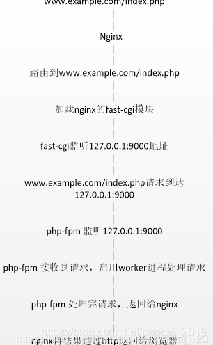

# oj
pdsuoj


## php7.2

### 代码路径信息

php配置文件路径`/etc/php/7.2/fpm/php.ini`  

这个文件修改后需重启php使修改生效`service php7.2-fpm restart`

代码路径`/home/judge/src/web/`

开发代码路径`/home/judge/src/web-dev/`

下面的信息都基于项目根目录

- 数据库等配置文件的路径`include/db_info.inc.php`

## 代码结构

假设主目录为`/home/judge/src/web/`
主目录下的php文件为后端文件，负责数据库查询，数组结构组装

其中前端在template/bs3/ 路径下
admin前端在 admin/ 路径下

```
tree -L 1

├── ace                        在线编辑器组件
├── acm_number.txt
├── acm_ranking.php            acm排名页面
├── admin
├── bbs
├── bbs.php
├── blog_show.php               博客
├── bootstrap
├── config.yaml
├── csrf.php
├── discuss3
├── edit_area
├── faqcss
├── favicon.ico
├── fckeditor
├── fonts
├── gpl-2.0.txt
├── highlight
├── image
├── include
├── index.php
├── kindeditor
├── lang
├── mergely
├── newranking_guize.txt
├── php_errors.log           日志，基本是警告与错误
├── qrcodetmp
├── reportlogin.html
├── study_vedio              学习视频
├── summary                  知识图谱   
├── template
└── upload

```


## nginx


nginx 是最流行，性能最强的web服务器，使用多路复用，性能很强，基本替代了以前的apache





nginx 配置文件路径 for 生产
`/etc/nginx/sites-enabled/default`

nginx 配置文件路径 for 开发
`/etc/nginx/sites-enabled/web-dev`

nginx 常用命令

nginx -t 检查配置文件是否正确
```
root@iZ2ze954cl1vua04rezfxcZ:/home/judge/src/web# nginx -t 
nginx: the configuration file /etc/nginx/nginx.conf syntax is ok
nginx: configuration file /etc/nginx/nginx.conf test is successful
```

nginx -s reload  使用新的配置文件重载nginx(编辑配置后，需重载使nginx生效, 正常情况下无输出）
```
root@iZ2ze954cl1vua04rezfxcZ:/home/judge/src/web# nginx -s reload
root@iZ2ze954cl1vua04rezfxcZ:/home/judge/src/web#

```


nginx配置文件demo

```nginx
# 主要区别在于listen 的端口以及root 的位置， 创建新的文件，并修改这两个，即可设置多个站点
server {
    
        listen 8000 default_server;            
        listen [::]:8000 default_server;

        include snippets/phpmyadmin.conf;
        root /home/judge/src/web-dev;

        # Add index.php to the list if you are using PHP
        index index.php index.htm index.nginx-debian.html;

        server_name _;

        location / {
                # First attempt to serve request as file, then
                # as directory, then fall back to displaying a 404.
                try_files $uri $uri/ =404;
        }

        # pass PHP scripts to FastCGI server
        #
        location ~ \.php$ {
                include snippets/fastcgi-php.conf;
        #
        #       # With php-fpm (or other unix sockets):
                fastcgi_pass unix:/var/run/php/php7.2-fpm.sock;
        #       # With php-cgi (or other tcp sockets):
        #       fastcgi_pass 127.0.0.1:9000;
        #}

        }#added by hustoj


}


```
