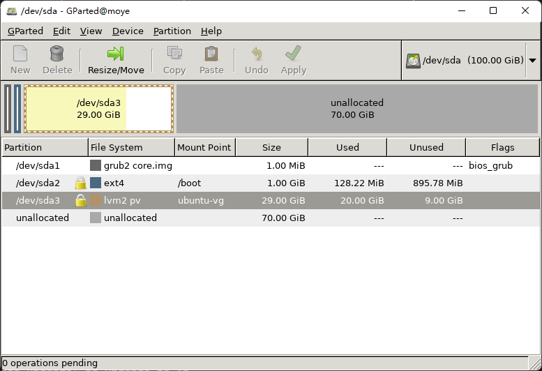

# vmware虚拟机硬盘调整


vmware 调整硬盘大小
> https://www.cnblogs.com/ZHJ0125/p/12904471.html
安装gparted

x11授权
sudo xauth add $(xauth -f ~moyechen/.Xauthority list|tail -1)

如果遇到

```

moyechen@moye:~$ sudo xauth add $(xauth -f ~moyechen/.Xauthority list|tail -1)
xauth:  timeout in locking authority file /home/moyechen/.Xauthority
xauth:  timeout in locking authority file /home/moyechen/.Xauthority


```

则执行

```
rm ~/.Xaut*
exit
再次登录时，会提示
/usr/bin/xauth:  file /home/moyechen/.Xauthority does not exist

然后创建该文件
```

>https://superuser.com/questions/315050/xauth-x11-ssh-forwarding-errors-with-xauthority-file-not-writable


最后启动程序

sudo gparted




 LVM
 
https://blog.csdn.net/Fly_1213/article/details/105142427

lvextend -L 80G /dev/mapper/ubuntu--vg-ubuntu--lv

resize2fs /dev/mapper/ubuntu--vg-ubuntu--lv
