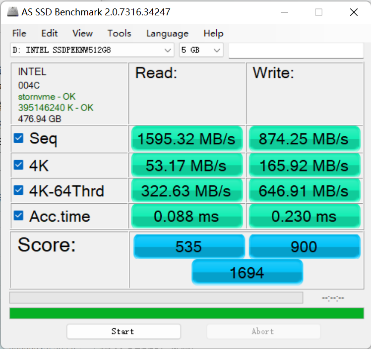
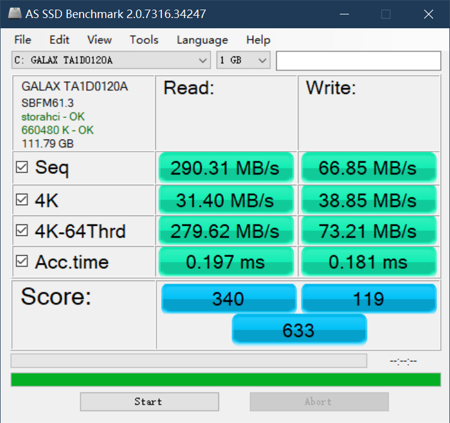
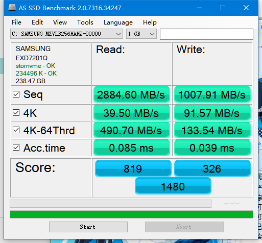
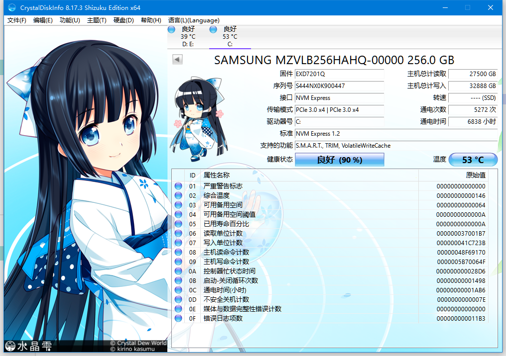
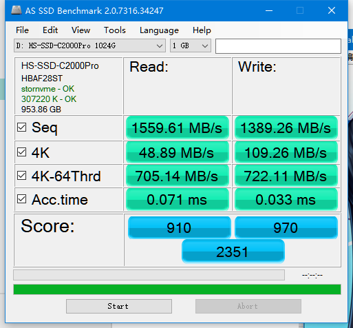
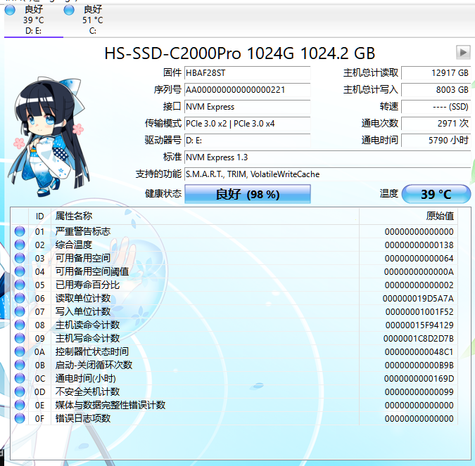

# 硬盘速度测试

### linux 测试磁盘性能

mkdir test-data
fio --rw=write --ioengine=sync --fdatasync=1 --directory=test-data --size=2200m --bs=2300 --name=mytest

Ideally, your disk should reach over 500 IOPS and below 10ms for the 99th percentile fsync latency. Read the etcd Docs for more detailed requirements.

### as ssd

