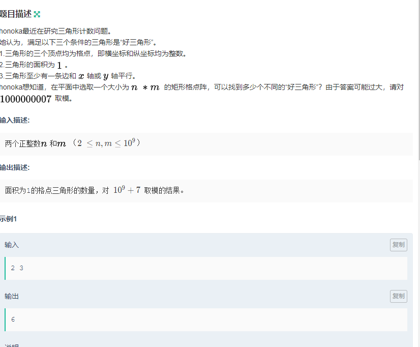

包含K个相同字符的最小子串
==========


先将位置保存,然后就遍历位置

```c++
#include<bits/stdc++.h>
using namespace std;
vector< vector<int> > lc(26);
int main()
{
int n,k;
int c = 0;
cin>>n>>k;
string s;
cin>>s;

for(int i=0;i<26;i++)
{
    lc[i].push_back(0);
}

for(int i=0;i<n;i++)
{
    lc[int(s[i]-'a')].push_back(i);
}

int minn=n+1;


for(int i=0;i<lc.size();i++)
{
    //printf("%c:  %d\n",'a'+i,lc[i].size());
    if(lc[i].size()-1 < k)
    {
        continue;
    }

    int len=lc[i].size();
    for(int j=k;j<len;j++)
    {
       minn=min(minn,lc[i][j]-lc[i][j-k+1]+1);
       //printf("minn = %d\n",minn);
    }
}

if(minn==n+1)cout<<"-1";
else cout<<minn;
}

```


三角形计数
==================



解法
-----------
先看底面积为1,高为2的三角形  
再看底面积为2,高为1的三角形(去重)

然后旋转图形90°,再做一次


```c++

#include <iostream>
#include <cstdio>
#include <algorithm>
#include <vector>
#include <queue>
#include <stack>
// *start on @date: 2020-02-04 14:34 
using namespace std;
typedef long long ll;
const int maxn = 1000 + 5;
ll mod = 1000000007;


int main() {
    ll n,m;
    cin>>n>>m;
    /*
    3 3 32

    2 3 6
    */
    //一行多少个         多少行
    //底为1
    ll d1 = ((n-1) %mod*(n)%mod    * (m-2)%mod*2%mod)%mod;
    
    ll d2 = ((n-2)%mod*(n-2)%mod   *(m-1)%mod*2%mod)%mod;
    //交换n,m;
    //cout<<d1+d2<<endl;

    swap(n,m);

    ll d3 = ((n-1) %mod*(n)%mod    * (m-2)%mod*2%mod)%mod;
    
    ll d4 = ((n-2)%mod*(n-2)%mod   *(m-1)%mod*2%mod)%mod;

    cout<<(d1%mod+d2%mod+d3%mod+d4%mod)%mod;

    

    
    return 0;
}

```


阿萨德
============


题解
----------


双指针一波带走

因为当前这个不满足的话, 那肯定要减少


```c++
#include <iostream>
#include <cstdio>
#include <algorithm>
#include <stdlib.h>
#include <math.h>
#include <string.h>
#include <vector>
#include <queue>
#include <stack>
#include <map>
#include <set>
using namespace std;
typedef long long ll;
typedef unsigned long long ull;
#define IOS                      \
    ios::sync_with_stdio(false); \
    cin.tie(0)

// *start on @date: 2020-02-04 15:44

ll dx[] = {0, 0, 1, -1};
ll dy[] = {1, -1, 0, 0};

int now[2];

int main()
{
    int n, k, t;
    cin >> n >> k;
    string s;
    cin >> s;
    int ans = 0, maxn = 0;
    //maxn为最长长度 i为放弃的前缀串 j为遍历时的当前串
    for (int i = 0, j = 0; j < s.size(); j++)
    {

        now[s[j] - '0']++;

        maxn = max(maxn, now[s[j] - '0']);

        while (j - i + 1 - maxn > k)
    //j-i为当前的剩余串，减去maxn就代表了与当前串中不同字符的个数，需要小于k
        {
            t = s[i++] - '0';
            now[t]--;
        }

        ans = max(ans, j - i + 1);
    }
    cout << ans << endl;
}
```
