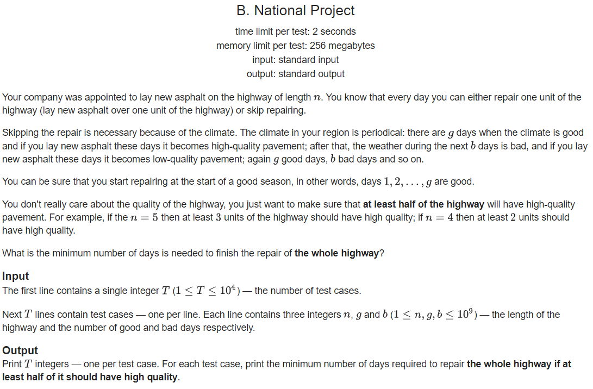
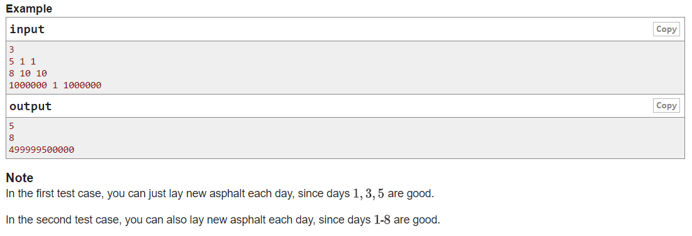

|time|author|
|--|--|
|2020/2/13 1:23|moyechen|








__think__

- 路长度为 `n`,每天可以修单位长度的路,或者休息
- 每过 `g` 个好的天气后, 就会迎来 `b` 个坏的天气
- 在好的天气修路, 可以使路的质量提高
- 在坏的天气修路, 使路的质量降低
- 最少要 `(n+1)/2` 个好的路
- 但是要把路修完(天数最少为 `n` )


__code__

```c++

#include <iostream>
#include <cstdio>
#include <algorithm>
#include <vector>
#include <queue>
#include <stack>
// *start on @date: 2020-01-30 19:38

/*
moyechen
2020 - 02 - 12 - 22 - 41
*/

using namespace std;
typedef long long ll;
const int maxn = 5e5 + 5;
const int inf = 0x3f3f3f3f;

int main()
{
    std::ios::sync_with_stdio(false);
    cin.tie(0);
    ll t, n, g, b;
    cin >> t;
    for (int i = 0; i < t; i++)
    {
        cin >> n >> g >> b;

        ll zq = (n + 1) / 2 / g; //好的修完,需要这么多周期

        ll sum = 0;
        if ((n + 1) / 2 % g == 0)
        {
            zq--; //少修一次,并补齐
            sum += g;
        }
        else
        {
            sum += (n + 1) / 2 % g;
        }

        sum += zq * (g + b);

        if (sum <= n)
        {
            cout << n << endl;
        }
        else
        {
            cout << sum << endl;
        }
    }

    return 0;
}

```
