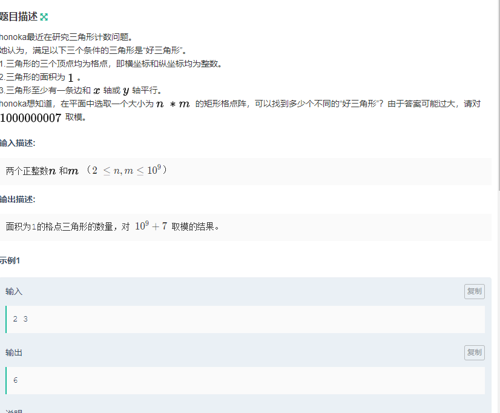

# 三角形计数



解法
-----------
先看底面积为1,高为2的三角形  
再看底面积为2,高为1的三角形(去重)

然后旋转图形90°,再做一次


```c++

#include <iostream>
#include <cstdio>
#include <algorithm>
#include <vector>
#include <queue>
#include <stack>
// *start on @date: 2020-02-04 14:34 
using namespace std;
typedef long long ll;
const int maxn = 1000 + 5;
ll mod = 1000000007;


int main() {
    ll n,m;
    cin>>n>>m;
    /*
    3 3 32

    2 3 6
    */
    //一行多少个         多少行
    //底为1
    ll d1 = ((n-1) %mod*(n)%mod    * (m-2)%mod*2%mod)%mod;
    
    ll d2 = ((n-2)%mod*(n-2)%mod   *(m-1)%mod*2%mod)%mod;
    //交换n,m;
    //cout<<d1+d2<<endl;

    swap(n,m);

    ll d3 = ((n-1) %mod*(n)%mod    * (m-2)%mod*2%mod)%mod;
    
    ll d4 = ((n-2)%mod*(n-2)%mod   *(m-1)%mod*2%mod)%mod;

    cout<<(d1%mod+d2%mod+d3%mod+d4%mod)%mod;

    

    
    return 0;
}

```