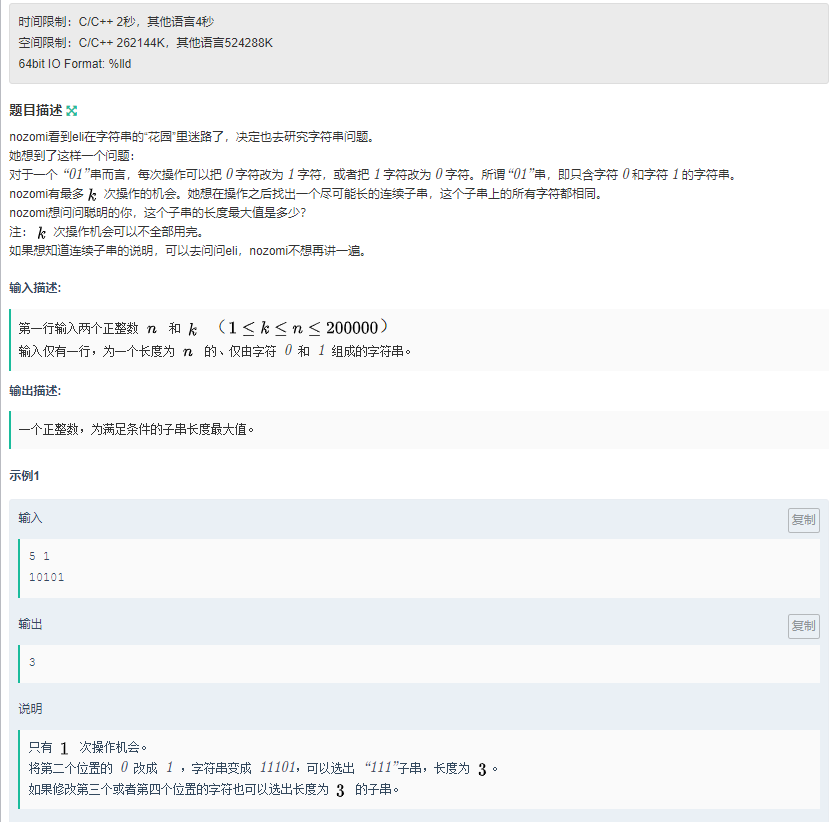

# 牛客新生训练营


题解
======
双指针一波带走

因为当前这个不满足的话, 那肯定要减少

^asd^


```c++
#include <iostream>
#include <cstdio>
#include <algorithm>
#include <stdlib.h>
#include <math.h>
#include <string.h>
#include <vector>
#include <queue>
#include <stack>
#include <map>
#include <set>
using namespace std;
typedef long long ll;
typedef unsigned long long ull;
#define IOS                      \
    ios::sync_with_stdio(false); \
    cin.tie(0)

// *start on @date: 2020-02-04 15:44

ll dx[] = {0, 0, 1, -1};
ll dy[] = {1, -1, 0, 0};

int now[2];

int main()
{
    int n, k, t;
    cin >> n >> k;
    string s;
    cin >> s;
    int ans = 0, maxn = 0;
    //maxn为最长长度 i为放弃的前缀串 j为遍历时的当前串
    for (int i = 0, j = 0; j < s.size(); j++)
    {

        now[s[j] - '0']++;

        maxn = max(maxn, now[s[j] - '0']);

        while (j - i + 1 - maxn > k)
    //j-i为当前的剩余串，减去maxn就代表了与当前串中不同字符的个数，需要小于k
        {
            t = s[i++] - '0';
            now[t]--;
        }

        ans = max(ans, j - i + 1);
    }
    cout << ans << endl;
}
```