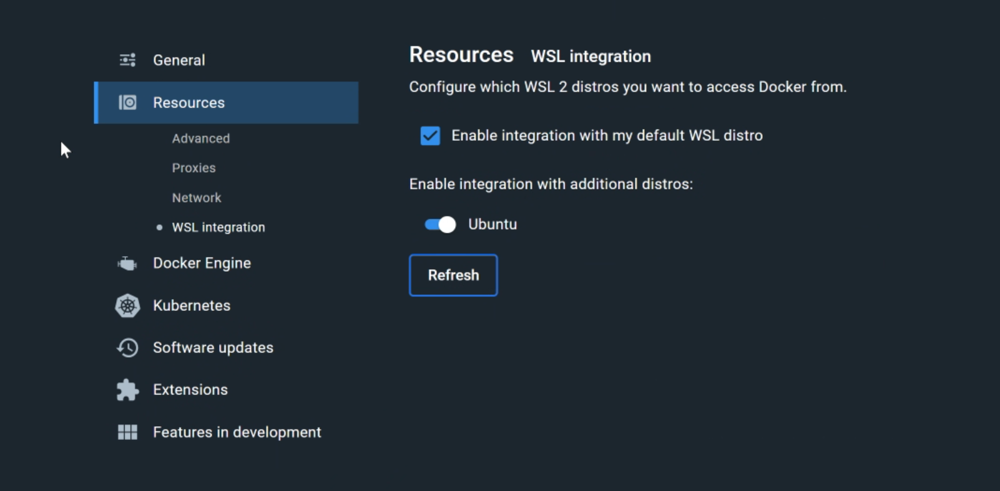
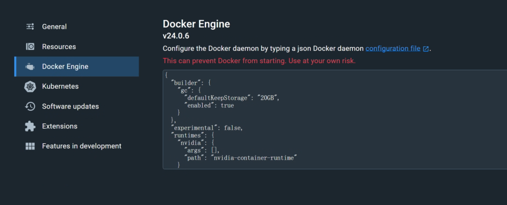

# webodm配置安装

## moyechen 23.9.24


环境配置
windows11

rtx4070 已在windwos部署好驱动,cuda


### 步骤1 wsl2配置
启动wsl
可能需要更新，wsl --update
打开微软应用闪电，搜索ubuntu，安装ubuntu

安装结束后，点击启动，需初始化ubuntu的账号密码

### 步骤1 安装docker desktop
从官网下载即可
启动后打开设置，勾选wsl2，选中刚安装的ubuntu



### ubuntu nvidia驱动配置

> https://docs.nvidia.com/datacenter/cloud-native/container-toolkit/latest/install-guide.html#installing-with-apt

进入ubuntu

配置gpgkey
```
curl -fsSL https://nvidia.github.io/libnvidia-container/gpgkey | sudo gpg --dearmor -o /usr/share/keyrings/nvidia-container-toolkit-keyring.gpg \
  && curl -s -L https://nvidia.github.io/libnvidia-container/stable/deb/nvidia-container-toolkit.list | \
    sed 's#deb https://#deb [signed-by=/usr/share/keyrings/nvidia-container-toolkit-keyring.gpg] https://#g' | \
    sudo tee /etc/apt/sources.list.d/nvidia-container-toolkit.list \
  && \
    sudo apt-get update
```

安装工具包
```
sudo apt-get install -y nvidia-container-toolkit
```


执行
```
sudo nvidia-ctk runtime configure --runtime=docker
```

但是wsl的配置文件不在```/etc/docker/```下，我们吧工具增加的内容复制出来，去docker desktop配置即可


修改后点击右下角apply&restart


重启完成后，检测是否部署成功

```
sudo docker run --rm --runtime=nvidia --gpus all ubuntu nvidia-smi
```

Your output should resemble the following output:

```
+-----------------------------------------------------------------------------+
| NVIDIA-SMI 535.86.10    Driver Version: 535.86.10    CUDA Version: 12.2     |
|-------------------------------+----------------------+----------------------+
| GPU  Name        Persistence-M| Bus-Id        Disp.A | Volatile Uncorr. ECC |
| Fan  Temp  Perf  Pwr:Usage/Cap|         Memory-Usage | GPU-Util  Compute M. |
|                               |                      |               MIG M. |
|===============================+======================+======================|
|   0  Tesla T4            On   | 00000000:00:1E.0 Off |                    0 |
| N/A   34C    P8     9W /  70W |      0MiB / 15109MiB |      0%      Default |
|                               |                      |                  N/A |
+-------------------------------+----------------------+----------------------+

+-----------------------------------------------------------------------------+
| Processes:                                                                  |
|  GPU   GI   CI        PID   Type   Process name                  GPU Memory |
|        ID   ID                                                   Usage      |
|=============================================================================|
|  No running processes found                                                 |
+-----------------------------------------------------------------------------+
```

### 步骤3 拉取项目文件

在打开的ubuntu中, 拉取项目（需提前安装git)

```
git clone https://github.com/OpenDroneMap/WebODM
```


### 步骤4 启动

```
./webodm.sh start --gpu
```


### mipc杂项

**时间估算**
132张照片大概一小时

132×132/5 ~= 3600

256张大概4小时


**gpu**
实际gpu使用率一直没上去，也不知道为啥


