# [k2p]更新官改固件v1.9中的ssr-server

目标：在k2p路由器上搭建ssr-server，在外网可以访问到家中的设备

遇到的问题：k2p官改固件v1.9 使用的ssr-server版本是`shadowsocks-libev 2.5.6 with OpenSSL 1.0.1j 15 Oct 2014`，支持的加密协议比较少

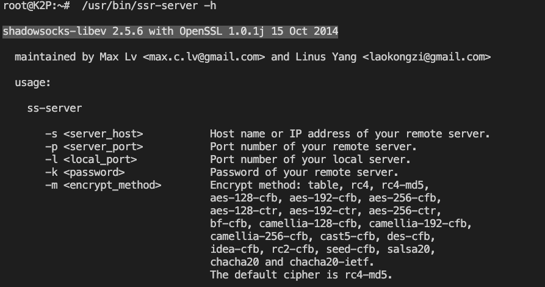


网络上比较推荐的加密算法是aes-256-gcm，打算更新路由器上的ssr-server


先到github https://github.com/shadowsocks/shadowsocks-libev 需要我们需要的安装包

```
root@K2P:~# cat /proc/version
Linux version 3.10.14 (jenkins@SOHO-OPWRT) (gcc version 4.8.3 (OpenWrt/Linaro GCC 4.8-2014.04 unknown) ) #1 SMP Fri Apr 20 15:17:54 CST 2018
```

通过上面的命令，我们可以知道k2p官改是openwrt系列的系统，找到适用于openwrt的版本 https://github.com/shadowsocks/openwrt-shadowsocks

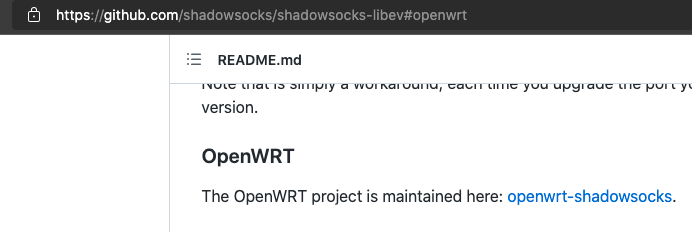

这个项目提供了预编译文件下载，我们到releases页面，进行下载 http://openwrt-dist.sourceforge.net/archives/shadowsocks-libev/3.3.5-1/
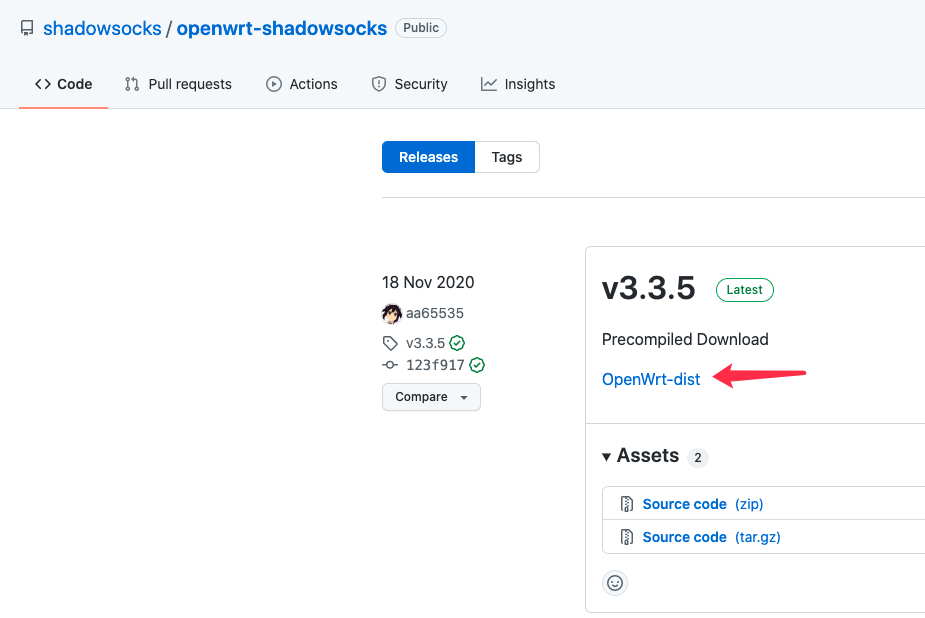


然后查看k2p的架构，我的k2p是a2版本，cpu是mt6621a,架构为mips 1004kc

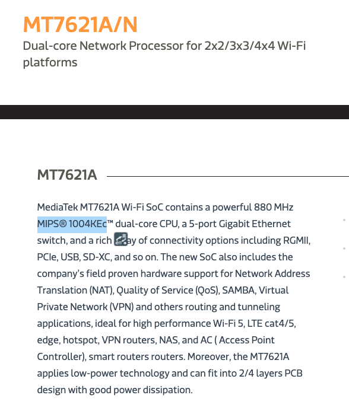

但是我们并没有找到适合1004kc的软件包

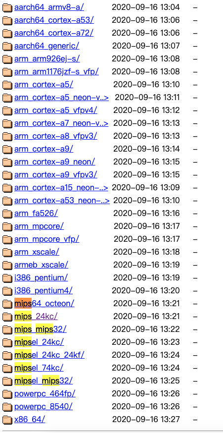

经过google搜索，我在恩山无线论坛找到了解决方案：使用mips 24kc即可，是兼容的 https://www.right.com.cn/forum/thread-256669-1-1.html

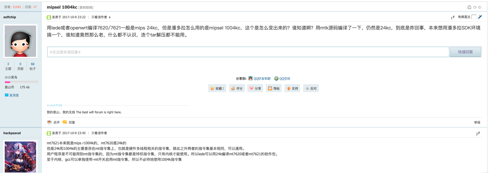


使用wget 下载到/tmp目录后，我们使用`opkg install shadowsocks-libev-server_3.3.5-1_ramips_24kec.ipk`命令进行安装，发现opkg报错：`pkg_hash_fetch_best_installation_candidate: Packages for shadowsocks-libev-server found, but incompatible with the architectures configured`

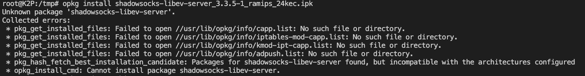


这是因为opkg发现此安装包声明的架构与系统支持的架构不符，我们使用`opkg print-architecture`命令输出该系统支持的安装包

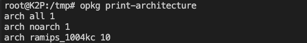


可以看到没有ramips_24kc

经google搜索，找到了解决方案

https://www.twblogs.net/a/5c766b60bd9eee339917f838
http://iotts.com.cn/blog/2020/12/13/OpenWrt-%E6%89%8B%E5%8A%A8%E5%AE%89%E8%A3%85ipk%E6%97%B6%E9%81%87%E5%88%B0%E7%9A%84%E9%97%AE%E9%A2%98/
https://blog.csdn.net/zengqz123/article/details/87915079
```

vi /etc/opkg.conf
然后在这个文件后面依次添加
arch all 100
arch ramips 150
arch ramips_24kec 200
arch ramips_1004kc 300
```

ok，再次尝试安装，发现缺少依赖

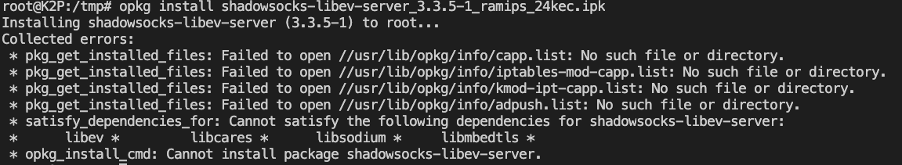


回到下载页面 http://openwrt-dist.sourceforge.net/archives/shadowsocks-libev/3.3.5-1/legacy/ramips/ 其实都在这里


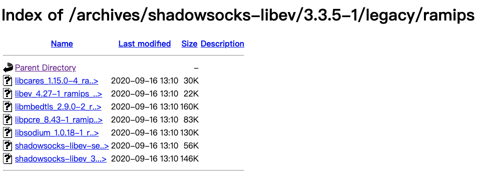


```
wget http://openwrt-dist.sourceforge.net/archives/shadowsocks-libev/3.3.5-1/legacy/ramips/libev_4.27-1_ramips_24kec.ipk
wget http://openwrt-dist.sourceforge.net/archives/shadowsocks-libev/3.3.5-1/legacy/ramips/libcares_1.15.0-4_ramips_24kec.ipk
wget http://openwrt-dist.sourceforge.net/archives/shadowsocks-libev/3.3.5-1/legacy/ramips/libsodium_1.0.18-1_ramips_24kec.ipk
wget http://openwrt-dist.sourceforge.net/archives/shadowsocks-libev/3.3.5-1/legacy/ramips/libmbedtls_2.9.0-2_ramips_24kec.ipk

```

安装成功
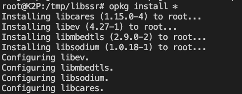


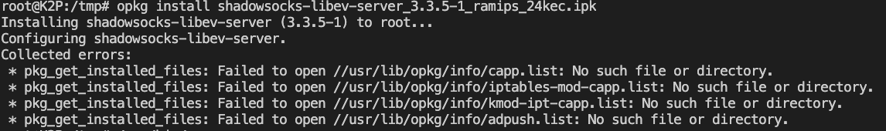


后面的错误信息其实无影响，安装后，可通过opkg查看文件信息

```
root@K2P:/tmp# opkg files shadowsocks-libev-server
Package shadowsocks-libev-server (3.3.5-1) is installed on root and has the following files:
/usr/bin/ss-server
```

安装成功!,aes-256-gcm可用

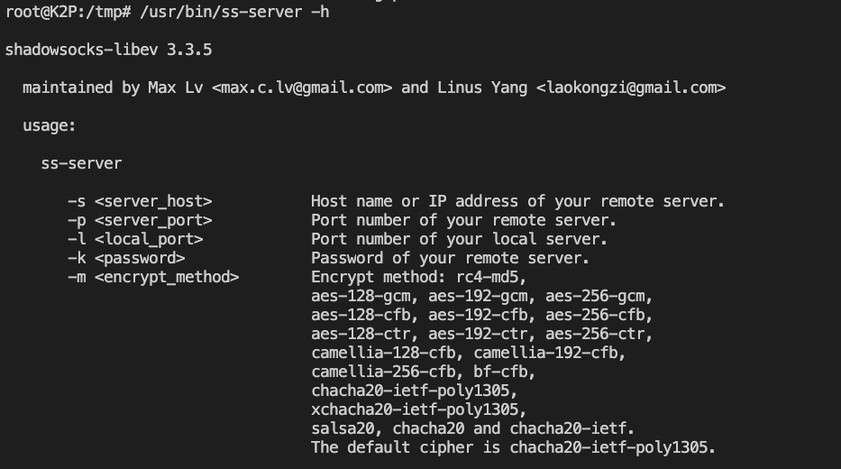


> opkg命令(https://www.cxymm.net/article/qq_41453285/102523263)
> 修改opkg.conf (https://www.twblogs.net/a/5c766b60bd9eee339917f838)
> openwrt翻墙教程 https://fanqiang.software-download.name/

https://me2in.github.io/2020/11/30/%E5%9B%9E%E5%AE%B6%E7%9A%84%E8%AF%B1%E6%83%91-%E8%AE%BA%E5%A6%82%E4%BD%95%E6%9B%B4%E4%BC%98%E9%9B%85%E7%9A%84%E5%9B%9E%E5%AE%B6/


clash for windows
https://docs.cfw.lbyczf.com/

cfw默认跳过内网地址
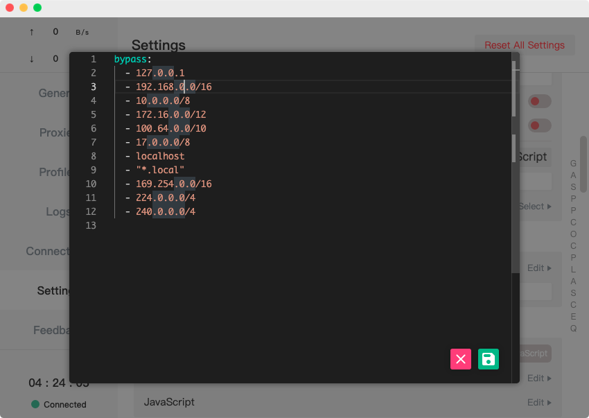