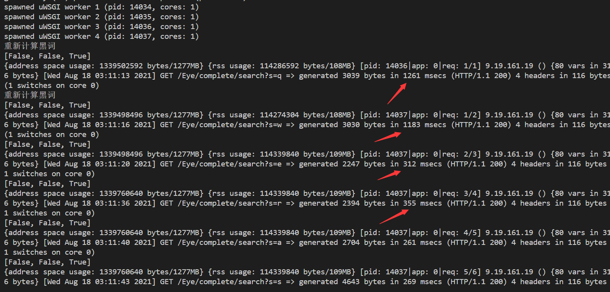

# django缓存

接口: 自动补全接口
程序中有预定义的词,但是需要进行去重和按拼音排序, 每次占用大量时间

优化: 使用django 缓存
https://docs.djangoproject.com/zh-hans/3.2/topics/cache/

由于该缓存是线程安全的, 每个线程独立拥有一个缓存,可以看到重启后前几次访问需要时间约1250ms, 之后收敛到250ms,提升400%的速度
