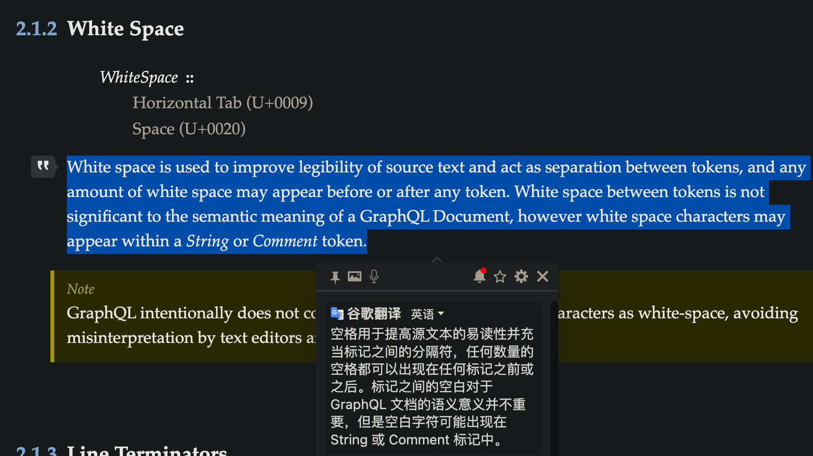
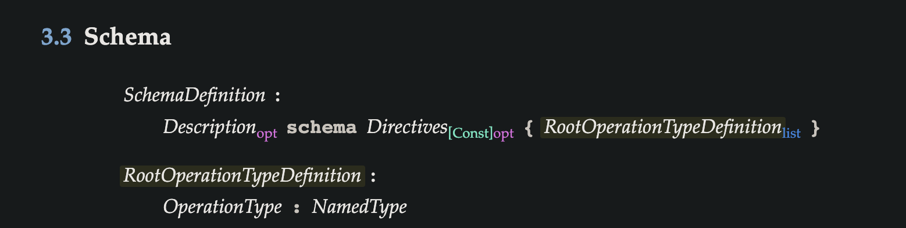

# graphql遇到过的问题


## 1.schema编写问题
正常情况下，需要在冒号右边加一个空格
```graphql
type XXX{
    
    required: Boolean
}

```


如果你不加的话，则会识别不到
>http://spec.graphql.org/October2021/#sec-Language





## 2.dataload 问题

当有一个数据的resolve字段没查到，则所有的数据都不会返回
```python
async def scheme_by_scheme_ids(self, scheme_ids: list[str]):
    async with self.repo.new_session(expire_on_commit=False):
        stmt = self.repo.select(MESSchemeOrm).filter(MESSchemeOrm.scheme_id.in_(scheme_ids))
        result = await self.repo.all(stmt)
        data = result.scalars().all()
    return sort(scheme_ids, data, key_fn=attrgetter("scheme_id"))
```

```python
@field_resolver("scheme")
async def resolve_scheme(self, parent: ProcessRepresentation, info):
    if process_id := get_attr(parent, "id"):
        process_scheme_id = SchemeId(f"scheme:process:info:{process_id}")
        loader = info.context["domain_loaders"]["scheme_by_scheme_ids"]
        return await loader.load(process_scheme_id)
```