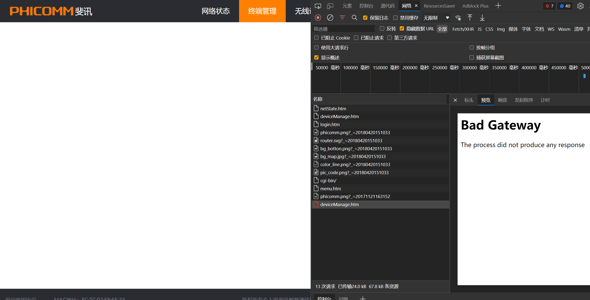
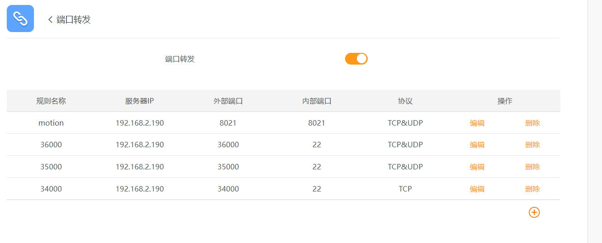
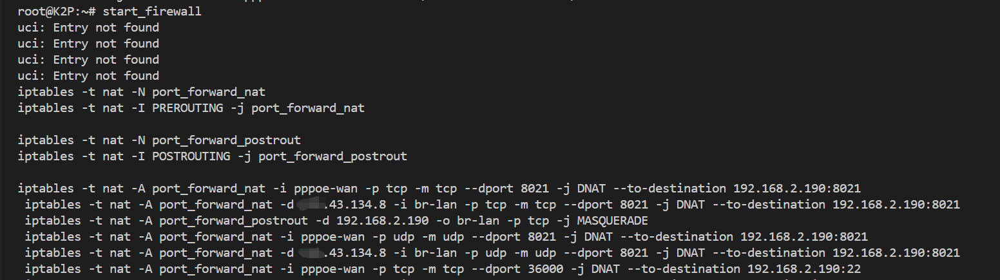
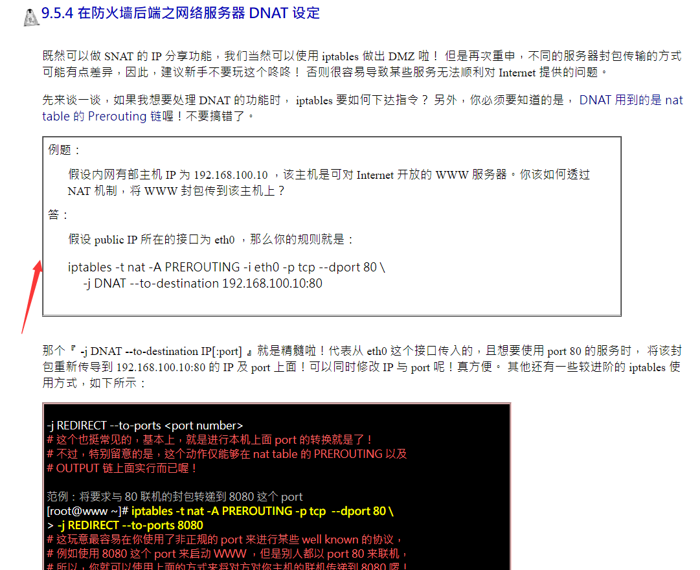

# k2p-luci

20220206
今天发现k2p的后台管理web一些功能无法使用了



为了修复这个问题,先对路由器上的web程序做了一下了解

后台服务器:uhttp
语言 lua


```
root@K2P:/# find  . -type d -iname 'luci'
./rom/usr/lib/lua/luci
./usr/lib/lua/luci
```


>https://blog.csdn.net/qq_28812525/article/details/103870169

```find / -type f -name "*.lua" | xargs grep "portfwd_add_rule"```
配置文件:
```
/etc/luci/*
/etc/init.d/portfwd 端口转发的配置转换
/etc/config/appportfwd 


iptables -L -v -n
```

### 2022/6/1
k2p动态ip失效






>鸟哥的私房菜
>http://cn.linux.vbird.org/linux_server/0250simple_firewall_5.php#nat_ip_share



iptables -t nat -A PREROUTING -i pppoe-wan -p tcp --dport 36000      -j DNAT --to-destination 192.168.2.190:22


iptables -t nat -L