# mac+win10双系统下的时间问题


安装了 Windows/macOS 双系统的同学，一定遇到过双系统时间不同步的问题。具体表现是，一旦进入过 macOS 系统，Windows 中的时间就会比实际时间慢8个小时（以国内为准）。

## 解决问题
遇到这个问题,我第一个想法是编辑计划任务,在windows系统开机的时候执行时间同步(因为windows默认是7天与时间服务器同步一次)

具体的逻辑是开机后,识别到wifi连接上事件(id8001),则执行与时间服务器同步的脚本

首先是定位到wifi连接上的事件,打开事件查看器,  应用程序和服务日志-Microsoft-Windows-WLAN-AutoConfig
可以看到下图,我们找到8001事件，他的描述是`WLAN 自动配置服务已成功连接到无线网络`
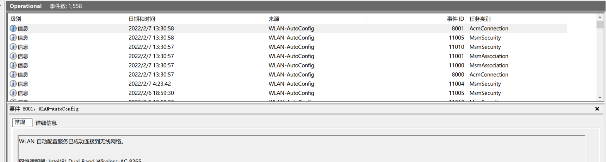

我整理了一下,大概有7个事件

事件8000 WLAN 自动配置服务已开始连接无线网络。
事件8001 WLAN 自动配置服务已成功连接到无线网络。
事件8003 WLAN 自动配置服务已成功从无线网络断开。
事件8005 WLAN 自动配置服务已开始启动承载网络。
事件8006 WLAN 自动配置服务已完成启动承载网络。
事件8008 WLAN 自动配置服务已开始停止承载网络。
事件8011 连接到上一个正常网络 

按照字面意思,我们应该使用8011事件作为触发器,但是查阅日志发现,最近几天我重启了好几次wifi,但是只有一次8011事件,可能有其他的因素在里面,我们还是选择事件8001作为触发器把。

在计算机管理-任务计划程序-新建计划任务,编辑触发器
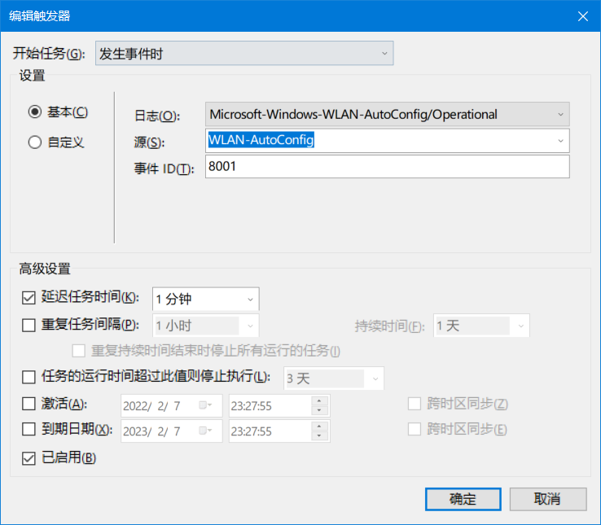

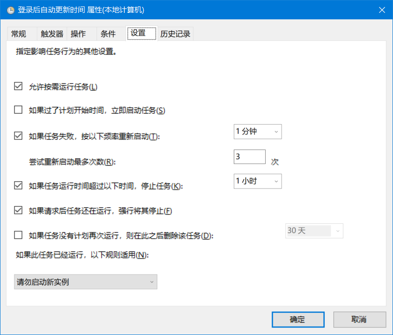


下面是更新系统时间的vbs代码，保存在本地后，新建执行程序

```vbs
Set ws = CreateObject("Wscript.Shell") 
ws.Run "net start w32time",vbhide,true
ws.Run "w32tm /resync",vbhide
```

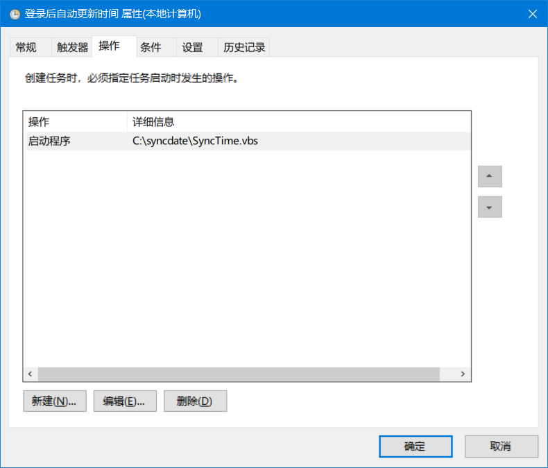

注意要勾选常规选项卡中的使用最高权限运行
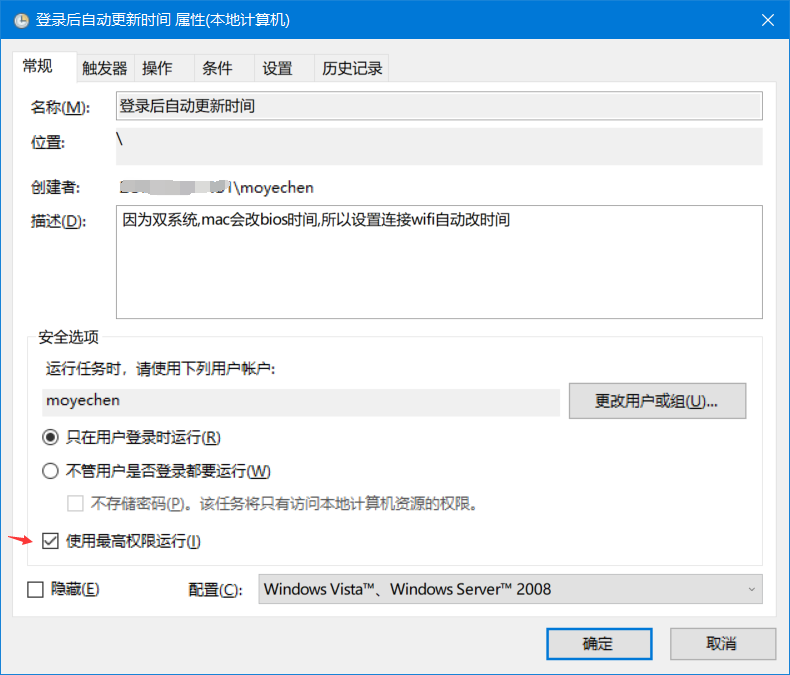


部署好后，每次启动笔记本，连接上wifi，时间就会自动同步到最新时间


## 遇到的问题

我开启了无线投屏,所以每次开机都会开放一个热点,然后系统自动连接上去,此时还没有连接到网络,所以同步失败,而且由于设置了重试和按需运行,导致3分钟连接到有网络的wifi并不会同步时间(因为按需运行)


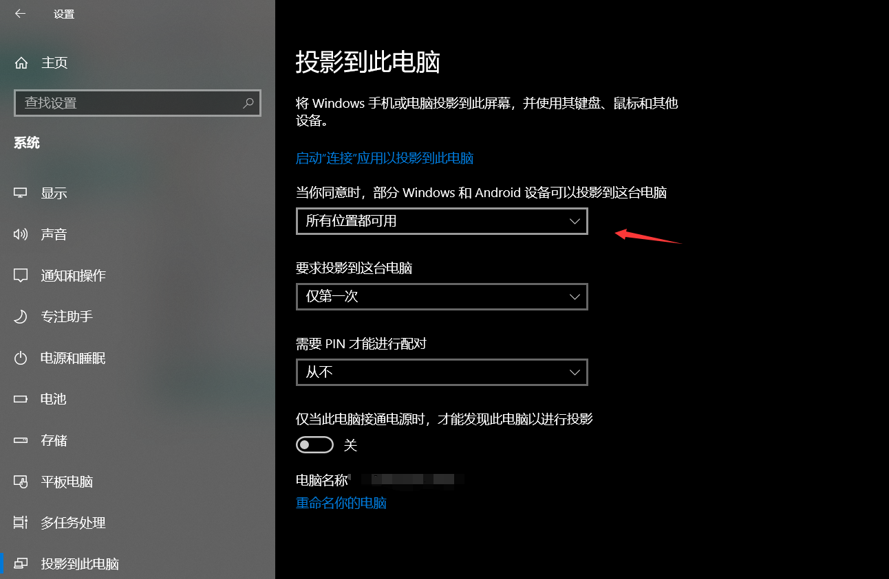
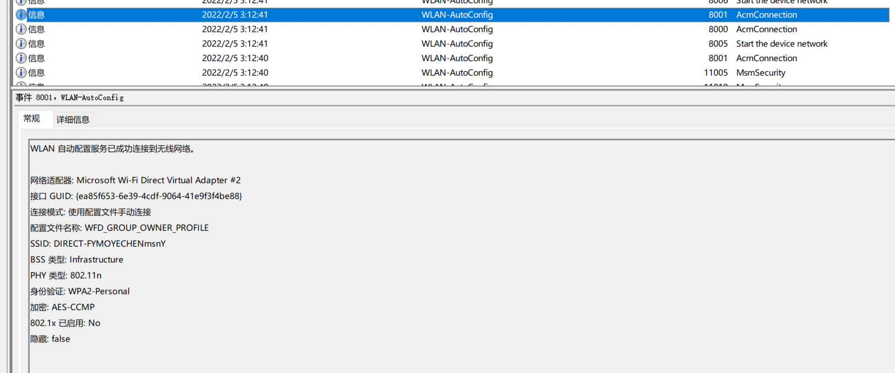


## 20220207 时间不同步的真正原因


问题的成因是Windows和macOS处理时间的方式不同：

Windows把系统硬件时间当作本地时间（Local Time），即操作系统中显示的时间和 BIOS 中显示的时间是一样的
macOS 则把硬件时间当作 UTC，操作系统中显示的时间是硬件时间经过换算得来的，例如：假设 macOS 中设置了东八区时区，系统显示时间早上9:00，实际硬件储存时间就是UTC 1:00。这个时候重启进入 Windows，时间就变成了早上1:00。


办法也很简单，就是让Windows把硬件时间当作 UTC 时间，保持和 macOS 一致。

Window7 用户点击左下角 开始 -> 运行 -> 输入CMD

Window8/10用户按下 Win+X 组合键，使用管理员模式进入CMD

输入以下命令：
```Reg add HKLM\SYSTEM\CurrentControlSet\Control\TimeZoneInformation /v RealTimeIsUniversal /t REG_DWORD /d 1```

不过看来这样bios时间又会出问题,所以我还是使用我的土方法把
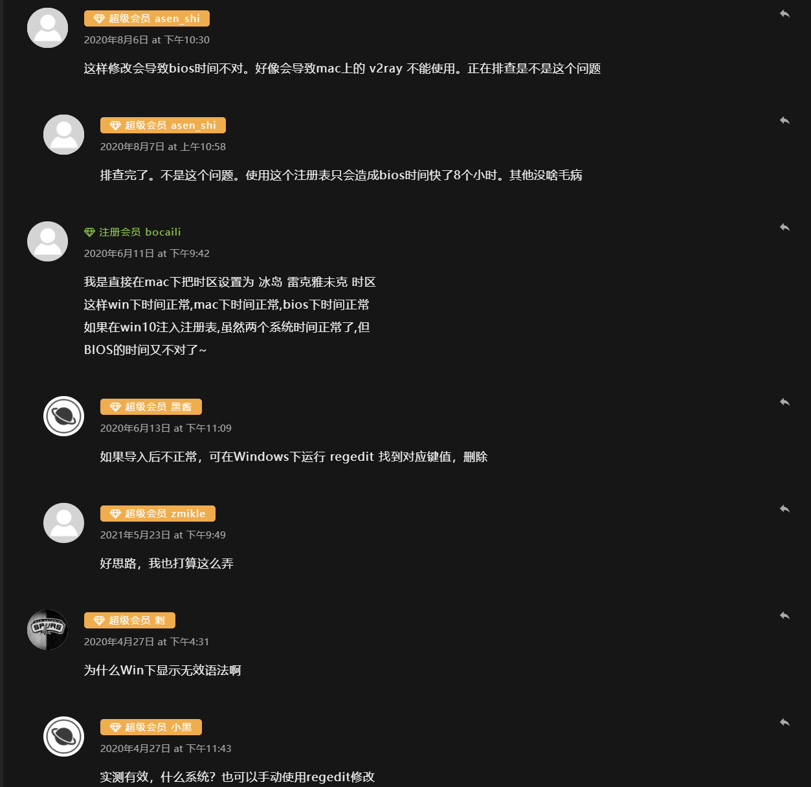


## 2022020 使用intel连接设置

今天在发现局域网samba传输速度只有5MB, 于是点开了网络设置,发现使用intel设置可以实现连接到特定wifi后执行应用程序

路径为 控制面板-网络连接-选中你当前连接的WLAN-状态-无线属性-
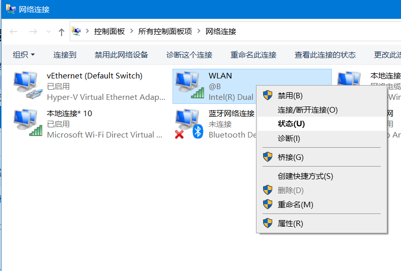

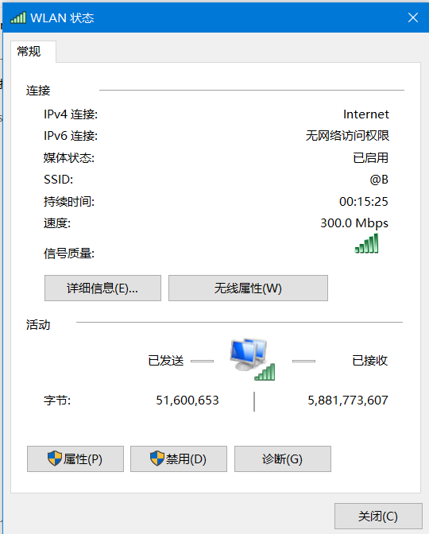

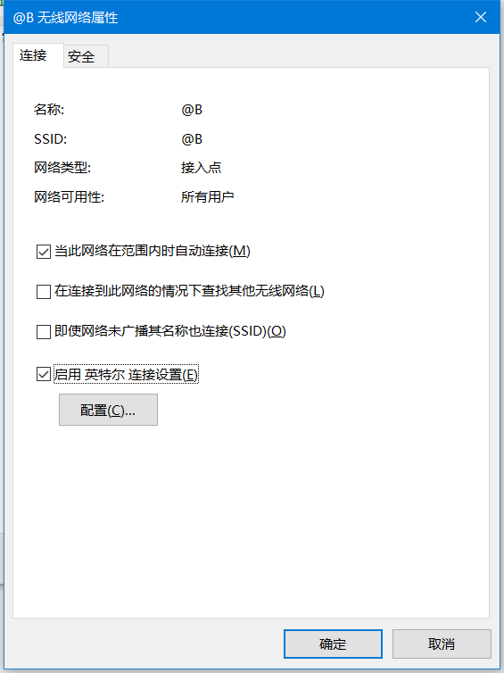

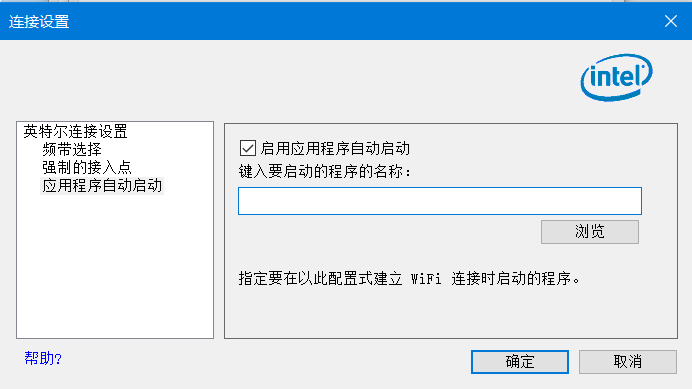

