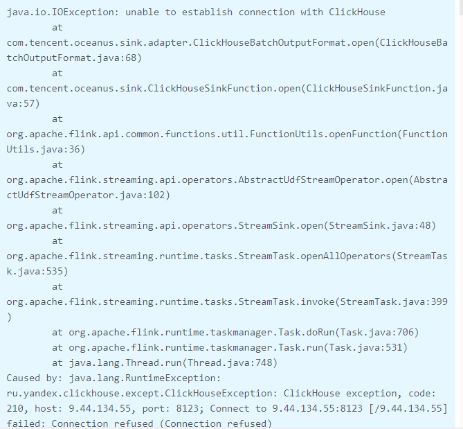
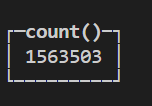
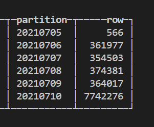
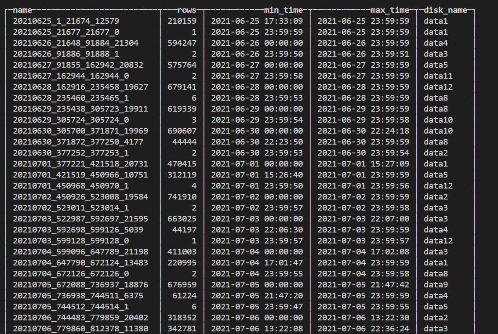
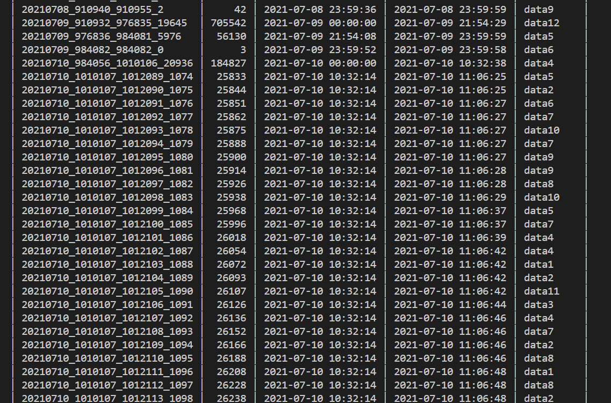
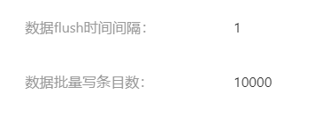
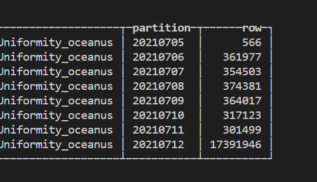
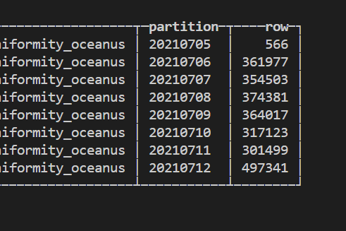
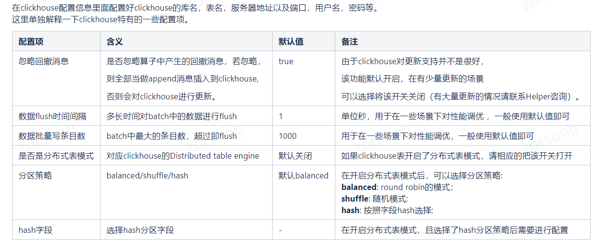

# oceanus

## 操作步骤

1. oceaus 平台建表, 包括海力方表和ch表, 其中要注意ch表写入时间(一般60)和写入量(10000+)
2. 新建任务
3. 申请资源
4. 运行任务


问题汇总

## 问题1
 复制海力方表的tid过去后, 自动填充的字段类型有错误,需要手动检查修改

## 问题2
类型正确后, 启动任务不闪退了,但是没数据, 查看日志发现连接本地ch数据库出了问题
3. 
通过百度了解到tcp端口为9000, 默认的http端口为8123, 但是我这里是修改过的, 因此是8080

修改为自定义的8080端口, ok


## 问题3:
使用select count(*) 查询数据量正常, 但是select sum(rows) 显示的数量要大的多






查找后发现是因为数据写入太快, 导致分区过多
可以看到前几天的数据都是一个分区, 这是ch后台合并的结果



但是查看当天的数据, 发现分了好多区,并且每一块都很小


发现是写入es批量太小, 且写入太快导致的

1. 增大批量写条目数, 设置为100000(默认为1000), 如果表过大, 可调整
2. 增大flush时间间隔 设置为60s(默认为1)
https://oceanus.oa.com/#/table/list




优化后

查询语句
```
SELECT 
    table,
    partition,
    sum(rows) AS row
FROM system.parts
WHERE (database = 'situation_awareness') AND (table = 'weilidai_antiCollection_socialUniformity_oceanus')
GROUP BY 
    table,
    partition
    WITH TOTALS
ORDER BY partition ASC
```
## 问题4 数据消费问题

需设置savepoint, 防止重启任务时中间数据丢失问题


## 问题5 导出至clickhouse数据库

官方文档中有说明, 只有1.14版本支持导出

https://iwiki.woa.com/pages/viewpage.action?pageId=746586889

https://iwiki.woa.com/pages/viewpage.action?pageId=703323873

