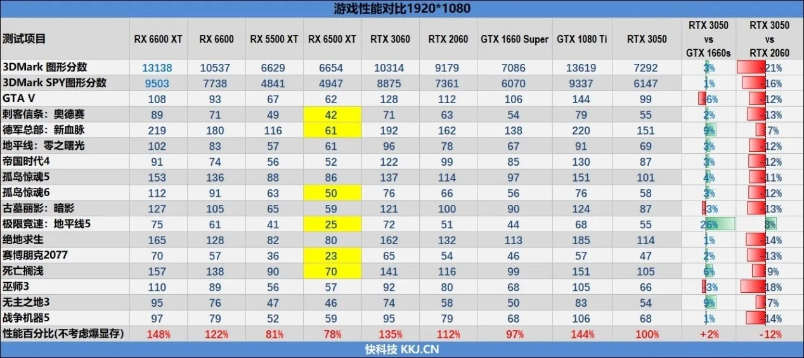

# 显卡

# 2023 5.19
970 4g 3700
980ti  5776
980 4337 

1080 ti 8g 9875
1080 7542

2070s 10123
2070  8925
2080ti 11g 14655
2080s 11588
2080 10996

3060ti 8g 12200  4.88
3060 12g 8696
(notebook)3060 6g 8300   
3070ti 8g 14826

3080ti 19568
3080 10g 17500
3090 24g 19799

4080 16g   28125 16g  8000
4070ti 12g 22753 12g   5800  3.92
4070 12g   17873  12g    4200  4.25

(*notebook)4080 12g 18890

6950xt 16g 21721     淘宝4400
6800xt 16g 19550     讯景6800XT海外版 3649 https://m.tb.cn/h.UF3ojs4  无个人送保  5.35
6750xt 12g 13588     瀚铠6750XT合金 2499元  5.43
6650xt 8g  10000      ️瀚铠6650XT合金 1789元 https://m.tb.cn/h.UE6t1Dh  5.58 
6600xt 8g  9500     ④淘宝️⭐️瀚铠6600XT 1544 https://m.tb.cn/h.UFCpx8G   6.15

(*notebook)4060  10473   6000
(*notebook)4050  8300 

## game fps

因此，可以选4070+4k144，

4k144 = 2500
4070   = 4200

