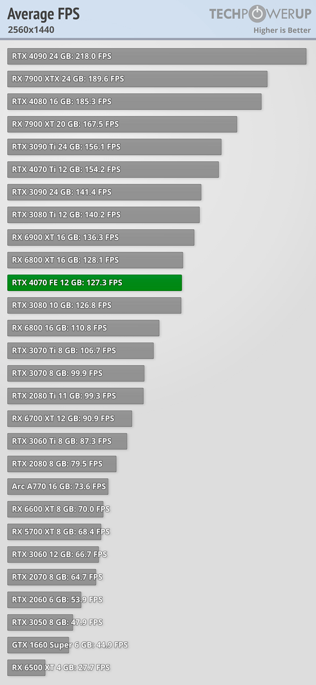
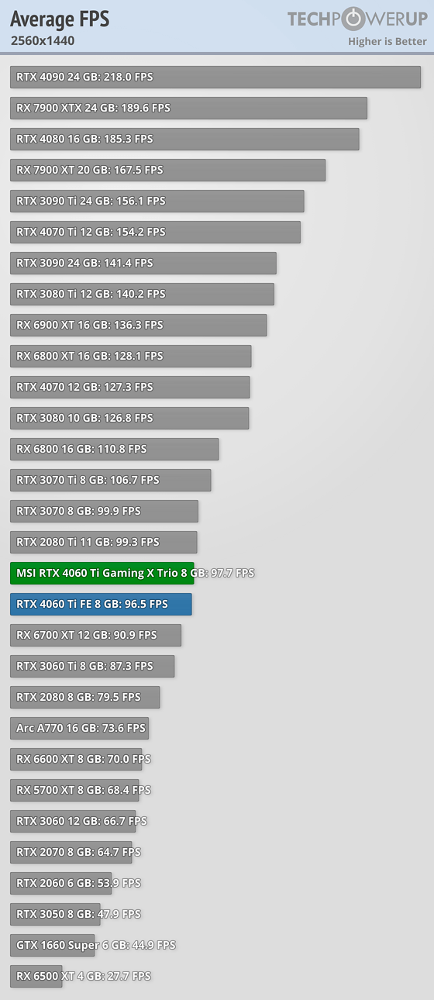
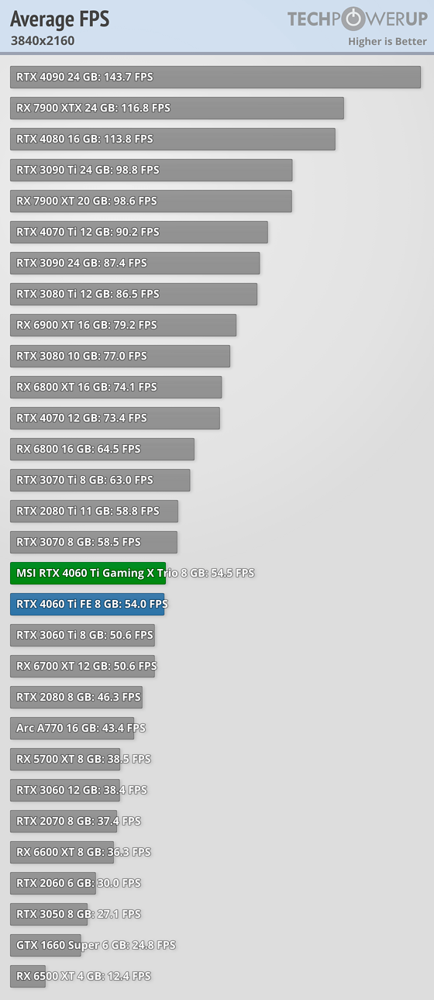
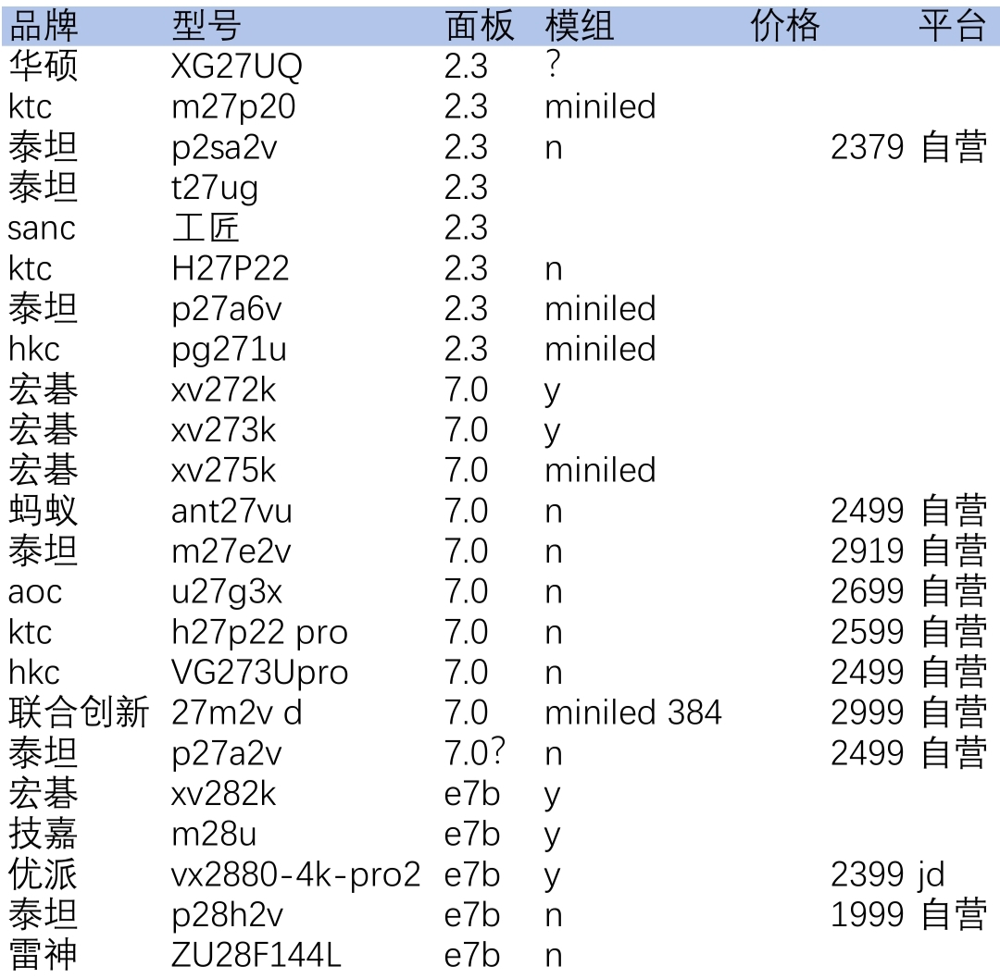
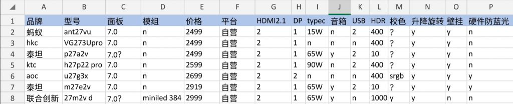

# 显卡需求分析

>4070 in techpower [single-page.html#introduction](https://www.techpowerup.com/review/nvidia-geforce-rtx-4070-founders-edition/single-page.html#introduction)

## 显卡fps表

上图中，是最高特效，所以，其实60帧数很优秀了

可以看到， 3060ti基本满足游戏4k60，但是2k144跑不满
可以考虑购买的，先买2k144，然后换4k144（因为4k144不成熟，价格不低，没必要一步到位）
或者直接买4k144，目前有2500的款式，感觉贵

方案1：
总价：3060ti 8g+2k 165（2500+1200 = 3700）, 畅玩2k 90fps，可用3.5年
提升：换显卡换显示器（那不是全换了吗，傻逼）
方案2：
总价   4070 12g+4k 144（4200 + 2500 = 6700）, 畅玩4k 73fps 可用6年
提升：加个2k显示器

2k又和1080p差不多，所以2k144

买2500的3060ti g6x，可以畅玩2k144
为了能用久一些，多加3000，购买4070，提升了 

长度 30+ 35，都可

宽度： 6cm以内，50最好

gtx 970冰龙 长度：300mm，高度：111mm；厚度：约6cm  350
电竞判客   319 117 49  4200
turbo     329 133 64  4200
ultra w   337 150 60  4400      

要解决几个问题

1. 蚂蚁ant27vu这款，是不是有不满血hdmi2.1的问题

蚂蚁电竞 ANT27VU 2699元
【推荐度】：高。 【定位】：SDR游戏

【配置】：友达7.0 OC，400nit亮度，传统LED背光，双HDMI 2.1，USB Type-C 15W

【总评】：4K高刷中的性价比之王，LG 27GP95R的低价平替，知乎吴彦祖亲手调教的产物

【注意】：这个显示器已经从友达2.3升级到友达7.0，而且加量不加价！但是老款和新款名字是一样的，判断新老的方法很简单：4K 160Hz的就是友达7.0的新款，4K 144Hz的是友达2.3老款。

【优点】

1，友达7.0新面板带来更好的观感和响应速度(4.0ms)，远超友达2.3，略胜群创E7B

2，接口丰富，做工良心，外观属于中配，比上面两个低配的要好很多。

3，背面RGB灯非常好看，正面还有投影灯（有点ROG的感觉，emmm，一定是借鉴!!!）

4，色域高，95% Adobe + 94% P3，同时适合摄影设计和大型单机游戏。

此外，就这个价位来说，它的均匀性还是不错的。得益于新面板它有着2.8ms的超快响应速度，逼近IPS面板的极限，所以也适合FPS游戏。

【缺点】

1，关机后显示器上的灯不会自动关闭，烦死人

2，HDMI 2.1接口在某些显卡上无法支持G-Sync，PC玩家用DP接口的话，可以无视这个缺点

2. aoc u27g3x 这款，不带typec，有没有混发面板问题

AOC U27G3X 3199元
[推荐度]:高。(定位]: SDR游戏，护眼办公
[配置]: 友达7.0 0C，400nit亮度，传统LED背光，双HDMI 2.1
[总评] : 性价比很高的硬件低蓝光显示器，友达7.0新面板，值得无脑入手!
[优点)
1，友达7.0新面板赋予了高响应速度，较好的观感，明显比友达2.3的一帮弟弟们要出色2，自带硬件抗蓝光，非常护眼，尤其适合文字工作者。虽然可能不是原厂模组，但是AOC也给
用上了支持硬件低蓝光的背光。
[缺点)
1，没有USB Type-C和USB-A扩展接口
2，调色方案比较激进，有些人可能觉得它的颜色太艳丽，也有些人恰好喜欢它的颜色
3，AOC这个系列的产品做工一般，远不如爱攻系列

3. 泰坦p27a2v这款，面板是不是7.0

4. hkc vg273upro 不带typec， 有没有问题
HKC VG273Upro 2699元
【推荐度】：中。 【定位】：SDR游戏

【配置】：友达7.0 OC，400nit亮度，传统LED背光，双HDMI 2.1，USB Type-C 15W

【总评】：这和蚂蚁ANT 27VU就是同一个东西，只是外壳不同，两个机器就是同一条生产线出来。HKC这台在外观做工上比蚂蚁ANT 27VU差，所以同价位下请买蚂蚁。

有时候VG273Upro会比ANT 27VU便宜100-200元，如果你不在乎外观，也可以买VG273Upro。

## 2k高刷&4k办公

Y27h-30。4USB-A+90W的Type-c      2k

飞利浦279P1 1999 90w 评论少 好评600 发布时间21年11月

vx2762-4k-mhdu 好评1000+，差评8，中评1
VX2880-4K-HDU-2 1499 hub hdr400 99%srgb tvu认证 65w  升降旋转 94%  2900+好评
VX2780-4K-HD-2 1650   hdr400      94% 1400好评
vx2731-4k 1299 99%srgb

aoc u27n3c 1799    唤醒慢 发布时间21年11月 5300好评 94%  每次从睡眠中唤醒，一线智联就不好用，typec线重新插拔一次

lg 27up600

27ul650 1750

雷电无信号：

ThinkPad的显示器识别问题和雷电接口故障解决
https://zhuanlan.zhihu.com/p/529323703

我的是关机拔掉充电器，长按电源键开机然后自动关机，再插上电源开机就好了
https://bbs.thinkpad.com/thread-7823411-1-1.html

为什么12代Intel笔记本雷电4或USB4外接显示器不支持Type-C DP独显直连？
https://www.bilibili.com/read/cv16411870