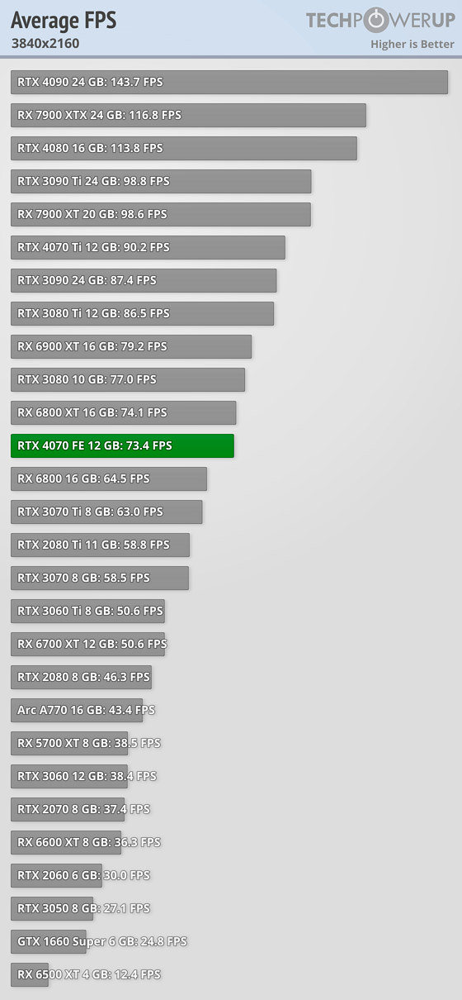

# 显卡需求分析

>4070 in techpower [single-page.html#introduction](https://www.techpowerup.com/review/nvidia-geforce-rtx-4070-founders-edition/single-page.html#introduction)

## 显卡fps表

上图中，是最高特效，所以，其实60帧数很优秀了

可以看到， 3060ti基本满足游戏4k60，但是2k144跑不满
可以考虑购买的，先买2k144，然后换4k144（因为4k144不成熟，价格不低，没必要一步到位）
或者直接买4k144，目前有2500的款式，感觉贵

方案1：
总价：3060ti 8g+2k 165（2500+1200 = 3700）, 畅玩2k 90fps，可用3.5年
提升：换显卡换显示器（那不是全换了吗，傻逼）
方案2：
总价   4070 12g+4k 144（4200 + 2500 = 6700）, 畅玩4k 73fps 可用6年
提升：加个2k显示器

2k又和1080p差不多，所以2k144

买2500的3060ti g6x，可以畅玩2k144
为了能用久一些，多加3000，购买4070，提升了 

长度 30+ 35，都可

宽度： 6cm以内，50最好

gtx 970冰龙 长度：300mm，高度：111mm；厚度：约6cm  350
电竞判客   319 117 49  4200
turbo     329 133 64  4200
ultra w   337 150 60  4400      

