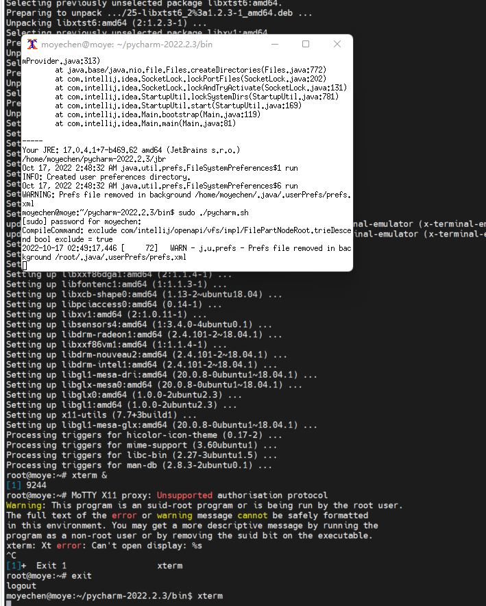

# ubuntu_x11





## 启动方式
moye用户

先启动xterm

然后sudo pycharm.sh启动pycahrm


## 遇到的问题

### 无法显示中文


73  apt install x11-apps
   74  exit
   75  xclock
   76  exit
   77  apt install xinit
   78  xterm &
   79  apt install xterm
   80  xterm &
   81  exit
   82  apt install gtk2-immodule-xim
   83  apt install fcitx

```bash
# start_pycharm.sh
export XIM_PROGRAM=fcitx
export XIM=fcitx
export XMODIFIERS=@im=fcitx
export DEPENDS=fcitx
/home/moyechen/pycharm-2022.2.3/bin/pycharm.sh
```

### 无法输入中文

暂时未解决