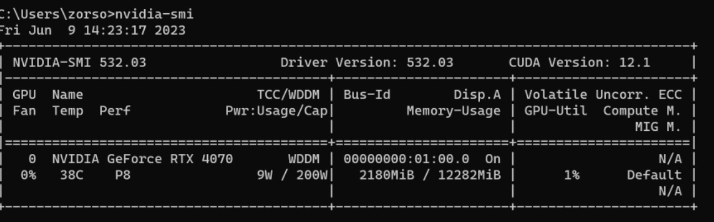

# 环境部署

## cuda

nvidia-smi 可以查看

## cudaa

## conda

科学计算时，使用conda可以方便的部署所需的python环境

### conda vs anconda

>https://zhuanlan.zhihu.com/p/379321816

### 安装

### 使用

1. 查看版本信息
conda -V 

2. 创建虚拟环境
conda create -n your_env_name python=x.x

3. 激活
conda active your_env_name

4. 查看已经创建的虚拟环境
conda env list   
conda info -e

5. 设置国内镜像

conda config --add channels https://mirrors.tuna.tsinghua.edu.cn/anaconda/pkgs/free/

conda config --set show_channel_urls yes

6. 恢复使用国内

conda config --remove-key channels
