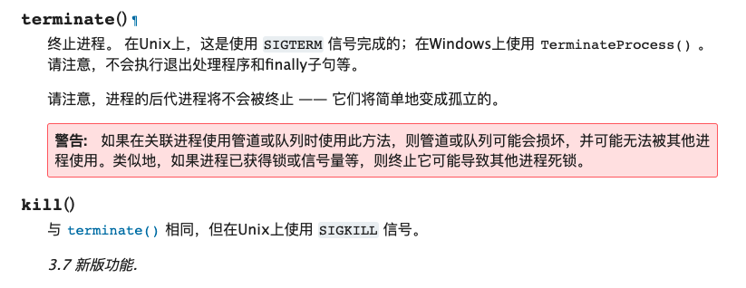

# pythongui-父子进程与孤儿进程

> https://www.cnblogs.com/Tour/p/5180801.html

先介绍一下我的项目，项目的目标是使用一台计算机，通过usb集线板，控制n台手机
其中不同的任务封装为不同的程序，在python gui中通过subprocess.Popen 方法异步调用

这些python程序会通过adb库获取到所有已经连接到的安卓手机，并通过multiprocessing库并行执行相应的任务

这时，有一个需求是停止当前的演示程序，我们知道，通过subprocess.Popen方法可以获取一个进程对象，通过调用kill方法或terminate方法即可杀死进程

但是随之而来的，就是子进程变为孤儿进程，仍在继续执行

通过查阅相关资料，我了解到可以设置deamon=True来使主进程在正常退出时，子进程也退出，但是我这里是中断操作

