# pdd调研

> 需求: 全量爬取拼多多商品

拼多多有以下客户端:

- h5端
- app端

其中h5端有加密,无法破解

## h5端

1. 首页推荐下滑
不需要登录, 按推荐展示商品, 每个分类最多2000商品, 即使登录了也只有2000个
2. 分类
需要登录, 理论上可获取选择的分类的所有商品
3. 搜索
需要登录, 理论上可获取和搜索关键词有关的的所有商品

### 渠道一:首页

推荐:  下滑拉取400个后, 显示查看更多

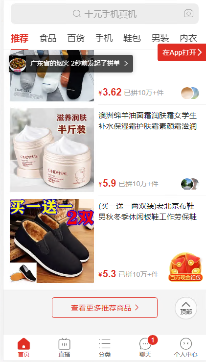

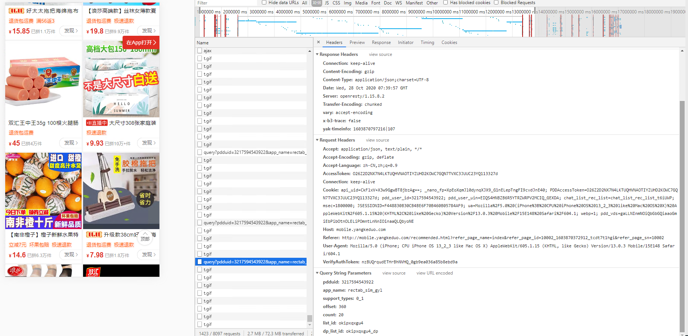

这个推荐手动拉到600左右, 如果太快就会触发验证

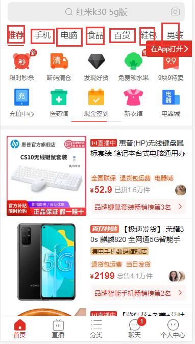

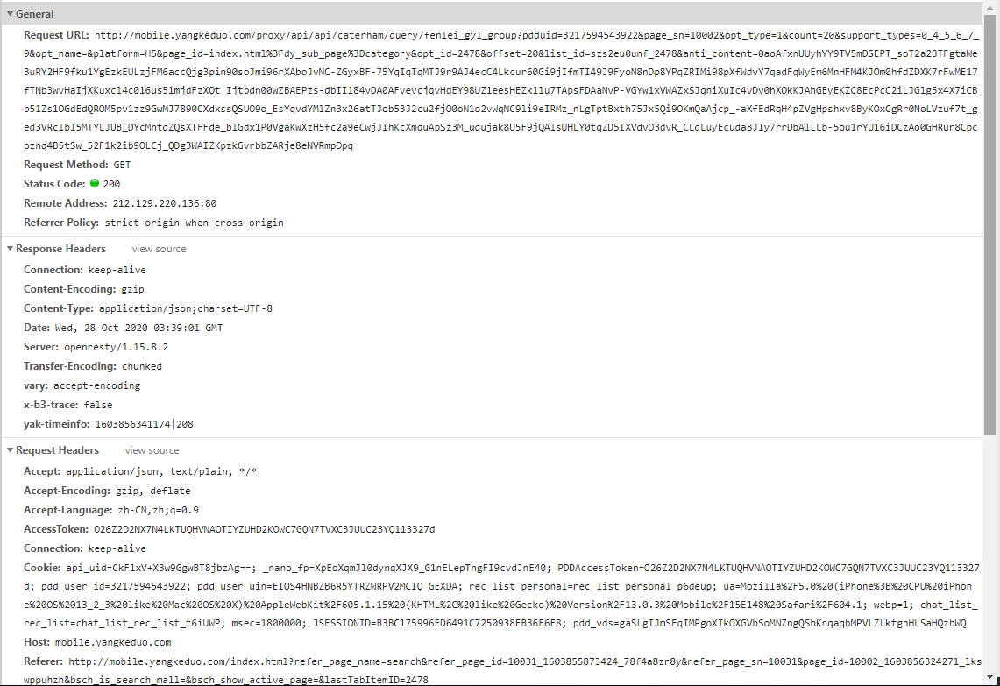 
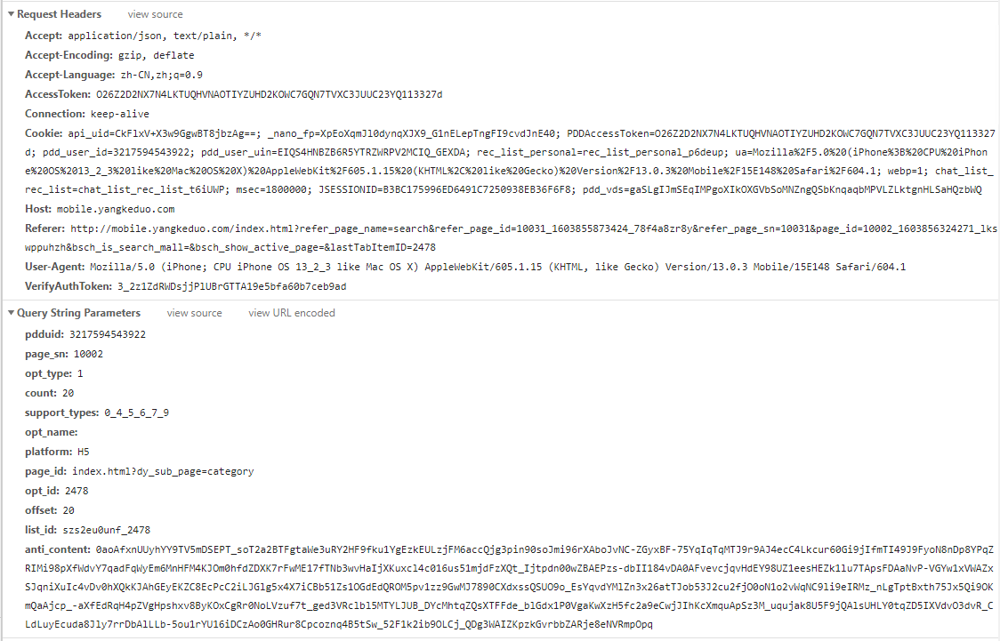

登录后, 在首页进行下滑, 可拉取该分类的最多2000条商品(根据不同账号, 推荐可能不同)

经过尝试, 虽然有加密, 但是一个token可以多次发送请求(可模拟器拉取一次后重放), 但是最多有2000条数据

且频率太快会触发安全验证(使用模拟下滑,.8-20秒发一次请求, 近300次请求不会触发验证)

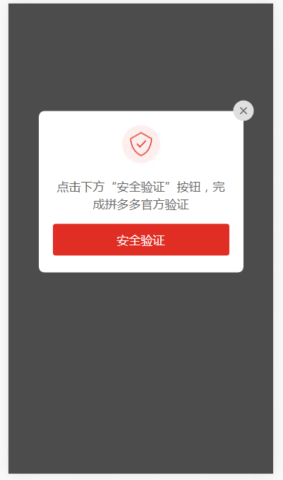

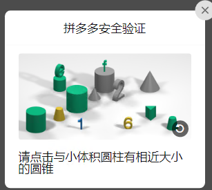 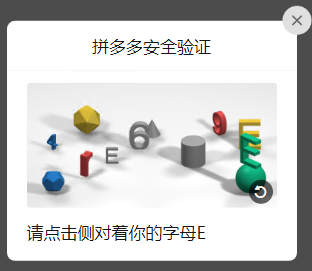  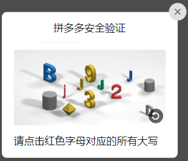
### 渠道二:分类
    

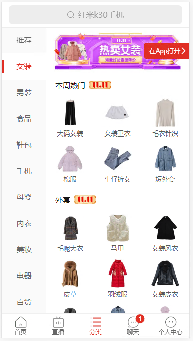

参数如下

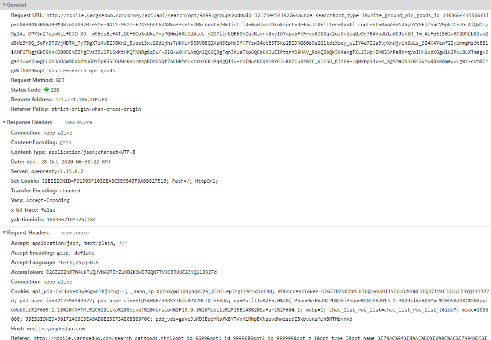

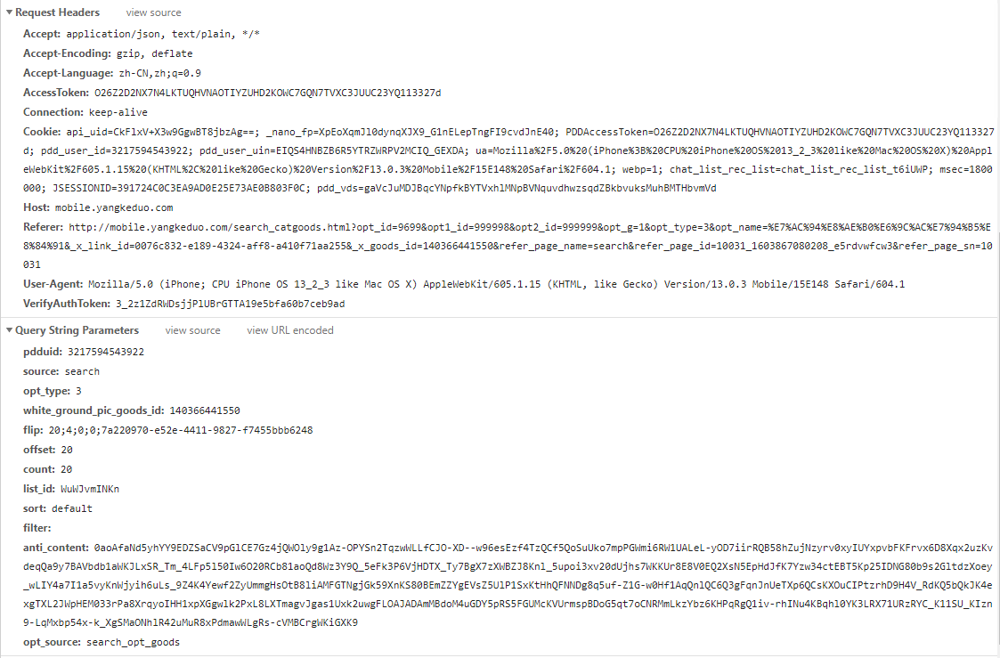

### 渠道三: 搜索

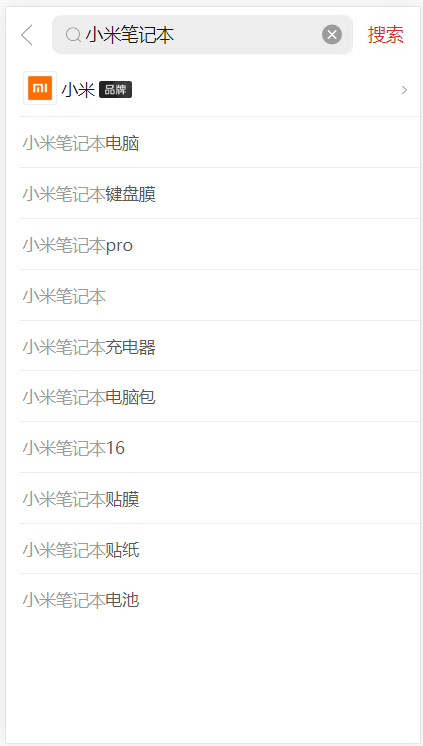

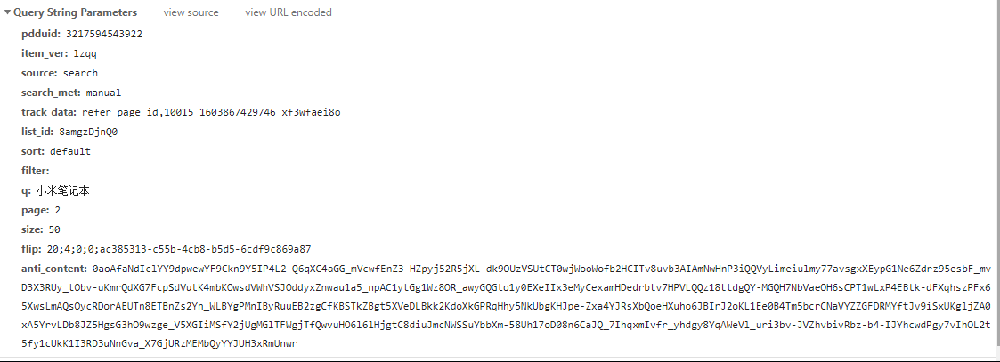

经测试这种方式获取商品无上限, 例如搜索`手机` , page 设置为50000 仍可获取到数据(可能会给重复数据)

- 需要关键词

