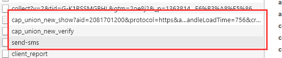
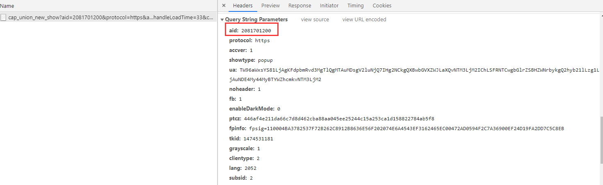
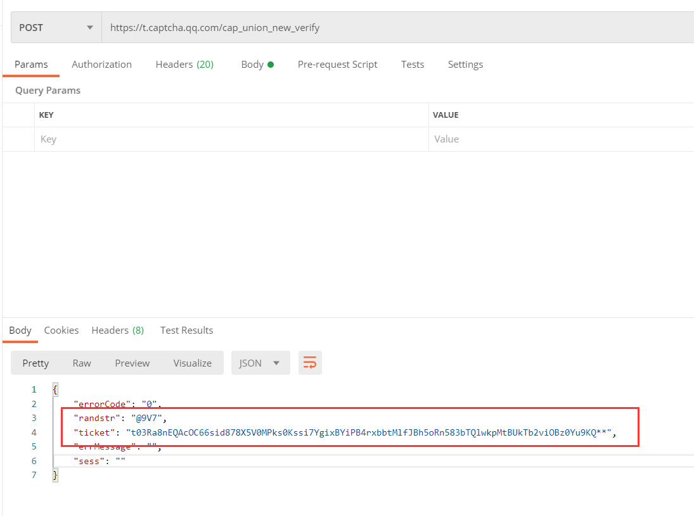
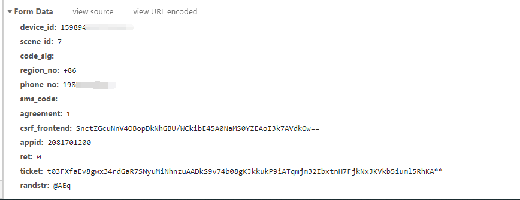

# 使用接口过tx滑块验证
>使用的接口
>https://www.notion.so/T-X-HTTP-637bca0458704724a5692a0e283ff5aa

>过验证码场景: 富途 https://passport.futunn.com/?target=https%3A%2F%2Fsetup2.futu5.com%2F&lang=zh-cn


### 0x00 抓包分析

首先我们手动操作一波, 发现三个和验证码有关的请求


- 其中第一个是用来展示验证码的, 抓包可以得到aid
- 

- 第二个则是我们将滑块滑倒尾端后发出的验证请求, 如果成功则可以得到`ticket`和`randstr`



- 接着是注册账号时发送短信验证码的请求, 可以看到里面有上个请求获取到的`ticket`和`randstr`字段


也就是说, 只要获取到ticket 等信息, 就可以发送短信验证码

### 0x01 获取ticket和randstr 
以下代码是对api的进一步封装
>用到的接口:
>https://www.notion.so/T-X-HTTP-637bca0458704724a5692a0e283ff5aa


```python

def get_ticket() -> dict:
    import json
    import time
    import requests
    """
    返回可过验证码的ticket和randstr
    :return:
    {"ticket":"t039_9QCC5xXgpqgLzf2a3PsLAiF2mWGTo9NuFTGKnifb1Xp42wUqn5JUQ-XrAwsNLg4M3fvoZ-cQnCuXVKcDX5nOsPbozWMeQ_","randstr":"@qHZ"}
    """
    print("需要人机验证,获取中~")

    aid = "2081701200" # 替换为你的aid
    user = "******"
    password = "******"

    session = requests.session()

    url = "http://gengduo.me/api/v1/alihd/wstask_tengx?aid={}&servertype=1&refer=&newtype=1&cap_cd=&asig=&user={}&pass={}".format(
        aid,
        user, password)

    # 尝试三次, 获取任务ID
    for i in range(3):
        try:
            res = session.get(url, timeout=7).json()
            print(res)
        except:
            pass
        else:  # 成功则停止
            break
    else:  # 均失败, 返回空
        return {}

    if "request_id" in res:

        request_id = res["request_id"]

        url = 'http://gengduo.me/api/v1/alihd/wstask_result?request_id={request_id}'.format(request_id=request_id)
        print(url)
        # 轮询60次
        for i in range(60):
            print(">>>", i)
            try:
                res = session.get(url, timeout=7).json()
                print(res)
            except:
                continue

            if "_status" in res and res["_status"] is True:
                try:
                    res_json = json.loads(res["_data"])
                    ticket = res_json["data"]
                    return ticket
                except Exception as e:
                    print(e)
            elif "_data" in res and "error" in str(res["_data"]):
                return {}
            time.sleep(3)

    return {}
```


