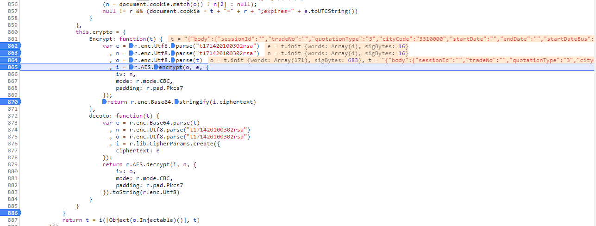
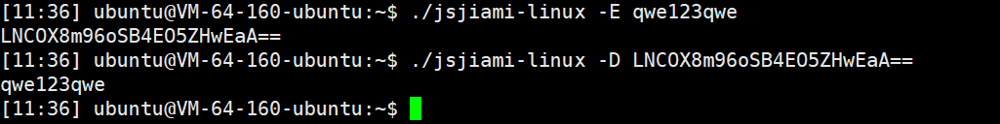

# 过简单js加密


>背景: 爬虫需要过加密的, 其中使用了第三方库
>pkg:  https://www.cnblogs.com/mordom/p/8337337.html


## 0x00 chrome debug



在这里可以看到, 使用的是crypto-js

根据google 搜索到了这么一篇博文
>https://www.codenong.com/js1a0dde3f1b57/ 

无奈本人对python 的Crypto模块 不太熟悉, 没能实现

只能编写js,并使用node 进行测试

使用前需安装node环境

```js

const r = require('crypto-js');

const { program } = require('commander');
//https://github.com/tj/commander.js

let crypto = {
    Encrypt: function (t) {
        var e = r.enc.Utf8.parse("t171420100302rsa")
            , n = r.enc.Utf8.parse("t171420100302rsa")
            , o = r.enc.Utf8.parse(t)
            , i = r.AES.encrypt(o, e, {
            iv: n,
            mode: r.mode.CBC,
            padding: r.pad.Pkcs7
        });
        return r.enc.Base64.stringify(i.ciphertext)
    },
    decoto: function (t) {
        var e = r.enc.Base64.parse(t)
            , n = r.enc.Utf8.parse("t171420100302rsa")
            , o = r.enc.Utf8.parse("t171420100302rsa")
            , i = r.lib.CipherParams.create({
            ciphertext: e
        });
        return r.AES.decrypt(i, n, {
            iv: o,
            mode: r.mode.CBC,
            padding: r.pad.Pkcs7
        }).toString(r.enc.Utf8)
    }
}

let Encrypt=crypto.Encrypt;
let Decoto = crypto.decoto;

program
    .version('0.0.1')
    .option("-E, --Encrypt <str>","Encrypt str")
    .option("-D, --Decoto <str>","decoto str")

program.parse(process.argv);

if (program.Encrypt){
    console.log(Encrypt(program.Encrypt))
}

if (program.Decoto){
    console.log(Decoto(program.Decoto))
}

```

初始化npm 并安装js依赖

```
npm init
npm i crypto-js
npm i commander
```


然后使用命令行进行调用
```shell

node main.js -D xxxxx

```


为了方便调用, 使用pkg 打包为linux 的可执行文件
>pkg:  https://www.cnblogs.com/mordom/p/8337337.html

```
pkg .

```

即可生成文件, 缺点是可执行文件比较大, 优点是开发成本比较低

使用:



-E 进行加密
-D 进行解密