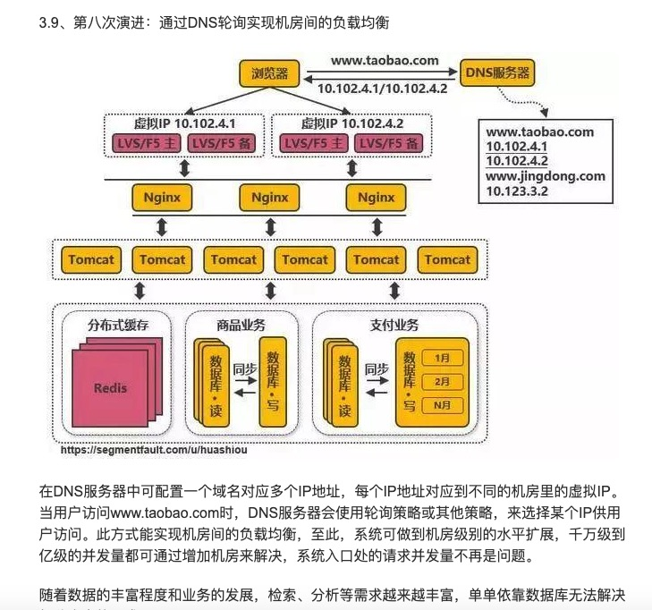

# 面试

1，网络 
1.1 本地dns服务器如何获取

通过DHCP协议从DHCP服务器获取，就和自动获取IP一样，DNS只不过是其中一个option。

 计算机设置自动获取后，它会向网内发送个广播，当服务器收到这个包时就会回应个地址给这台机器，机器取到回应后设置完成
 路由器也是类似,从他连接到的运行商发送这个广播
通过DHCP协议从DHCP服务器获取，就和自动获取IP一样，DNS只不过是其中一个option。

车小胖​​计算机网络话题下的优秀答主19 人赞同了该回答主机在启动时，会发送一个广播DHCP报文来寻找DHCP服务器，来给自己分配上网用的IP地址，DNS服务器地址等信息：什么是DHCP？Dynamic Host Configuration Protocol，动态主机配置协议，它主要用来给用户的电脑分配以下信息：1）IP地址  如 10.1.1.22）IP地址对应的子网掩码 如 255.255.255.0 DHCP 里有很多选项option，子网掩码放在option 1里3）缺省网关  如 10.1.1.1 Option 3，当主机10.1.1.2 想访问互联网，需要把IP包先发给缺省网关10.1.1.1，然后缺省网关再发送给它上游的路由器4）DNS 服务器 如8.8.8.8这个DNS 服务器就是放在option 6信息字段里的，DNS 服务器负责域名和IP地址的翻译，比如你访问 http://www.zhihu.com ，DNS服务器可以把它翻译成115.21.37.139，然后主机就可以用这个IP地址来访问知乎了。那DHCP的安全漏洞是什么呢？如果一个邪恶软件伪造不同的Mac地址，不断发送DHCP discovery，比如1000个，如果没有安全措施，DHCP server很有可能就分配1000个IP地址给它，因为server是根据client Mac来分配IP的，这样很快就可以把地址池资源耗尽，其它的用户因为没有地址可用而无法上网！应对方法：配置DHCP option 82，DHCP discovery途径二层交换机时，交换机修改报文，增加option 82信息，即这条消息是从哪个端口收到的，把这个端口信息添加到DHCP discovery 报文里，服务器根据 “client Mac地址+ 交换机端口号” 来分配IP，即任意一个交换机端口最多分配一个IP，即使采用伪造的不同的Mac地址来请求也是一个！这就是DHCP反欺骗措施，DHCP Anti-Spoofing！----------回复@唐诗宋词评论----------Option 82 是 谁来添加到DHCP 消息报文？ 添加到什么报文？ 主要作用是什么？主要作用是什么？1) line ID 让Radius server 可以知道DHCP client location 信息，比如 switch x Port x/x/x ，可以提供安全认证服务器更多关于 client 具体位置，可以 tracking and logging DHCP client2) remote ID ，可以让DHCP server 依靠 remote ID + Hardware MAC 来分配IP，避免伪造 MAC 耗尽IP地址池。谁来添加到DHCP 消息报文？1) DHCP snooping switch2) DHCP relay router添加到什么报文？ 1) DHCP Discovery2) DHCP Request编辑于 2016-07-17 10:08​赞同 19​​5 条评论​分享​收藏​喜欢收起​

由器转发 DNS 请求
1.2 更新域名指向，边缘dns服务器如何知道更新了
 缓存获取后，再次查询
 
1.3 qq.com 如何承受这么大的访问量
 cdn， dns根据所在地提供不同的ip
 然后做负载均衡

1.4 https 密钥交换算法
 DH算法
 密钥协商算法

1.5 cc攻击， ddos攻击原理

  tcp land攻击

1、SYN Flood攻击
SYN Flood攻击是当前网络上最为常见的DDoS攻击，它利用了TCP协议实现上的一个缺陷。通过向网络服务所在端口发送大量的伪造源地址的攻击报文，就可能造成目标服务器中的半开连接队列被占满，从而阻止其他合法用户进行访问。 [7] 
2、UDP Flood攻击
UDP Flood是日渐猖厥的流量型DDoS攻击，原理也很简单。常见的情况是利用大量UDP小包冲击DNS服务器或Radius认证服务器、流媒体视频服务器。由于UDP协议是一种无连接的服务，在UDP Flood攻击中，攻击者可发送大量伪造源IP地址的小UDP包。 [7] 
3、ICMP Flood攻击
ICMP Flood攻击属于流量型的攻击方式，是利用大的流量给服务器带来较大的负载，影响服务器的正常服务。由于目前很多防火墙直接过滤ICMP报文。因此ICMP Flood出现的频度较低。 [7] 
4、Connection Flood攻击
Connection Flood是典型的利用小流量冲击大带宽网络服务的攻击方式，这种攻击的原理是利用真实的IP地址向服务器发起大量的连接。并且建立连接之后很长时间不释放，占用服务器的资源，造成服务器上残余连接(WAIT状态)过多，效率降低，甚至资源耗尽，无法响应其他客户所发起的链接。 [7] 
5、HTTP Get攻击
这种攻击主要是针对存在ASP、JSP、PHP、CGI等脚本程序，特征是和服务器建立正常的TCP连接，并不断的向脚本程序提交查询、列表等大量耗费数据库资源的调用。这种攻击的特点是可以绕过普通的防火墙防护，可通过Proxy代理实施攻击，缺点是攻击静态页面的网站效果不佳，会暴露攻击者的lP地址。 [7] 
6、UDP DNS Query Flood攻击
UDP DNS Query Flood攻击采用的方法是向被攻击的服务器发送大量的域名解析请求，通常请求解析的域名是随机生成或者是网络世界上根本不存在的域名。域名解析的过程给服务器带来了很大的负载，每秒钟域名解析请求超过一定的数量就会造成DNS服务器解析域名超时。 [7] 

代理CC攻击是黑客借助代理服务器生成指向受害主机的合法网页请求，实现DDoS，和伪装就叫：cc（Challenge Collapsar）

1.6 负载均衡，如果一个机器挂掉，其他的机器应该怎么办

     按照处理极限接手部分流量，其余流量则丢弃

1.7 快速移动的情况下，会发生什么（基站带宽改变，基站切换
    
    优化: 使用httpdns,内置一些ip服务器做httpdns
        使用quic

弱网络优化

HttpDNSLib
1）lbs 返回服务器 ip 而非域名
2）本地缓存 lbs ip 地址备用，请求 lbs 时优先使用 ip 而非域名

icmp ping