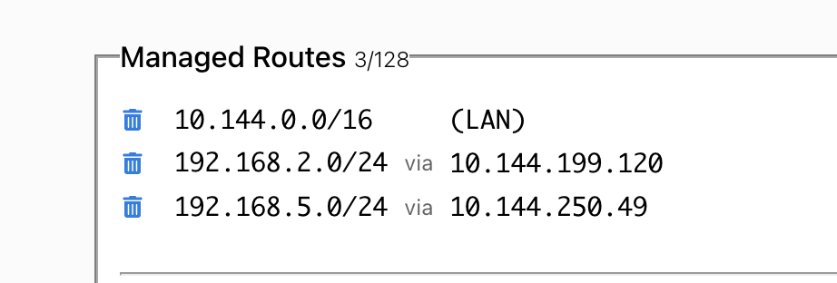
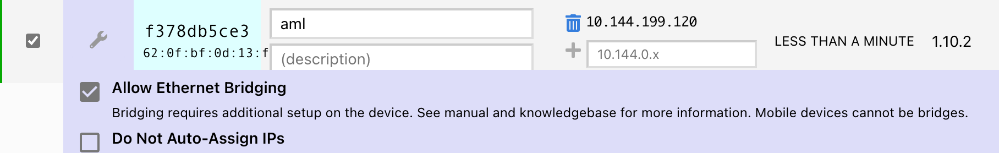
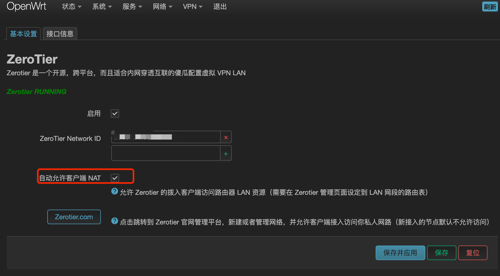
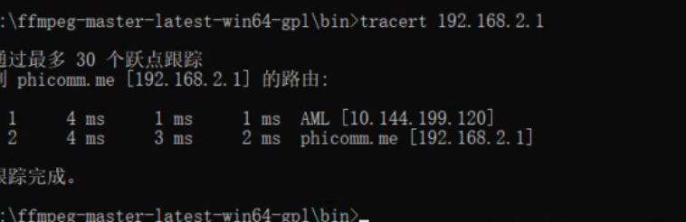

# zerotier


> https://stray.love/jiao-cheng/zerotier-zhong-jie-jiao-cheng
> https://zhuanlan.zhihu.com/p/383471270

使用zerotier完成内网穿透


优点：无需公网ip，即可大概率p2p打通
缺点：移动的设备需要每台设备都安装客户端， 固定的设备可通过路由器安装zerotier直接管理


## 实战配置


zerotier安装在路由器时，可以自动管理
但是路由器装不了， 所以被迫安装到了n1盒子上，也可以通过设置路由表进行管理


网络情况如下：

hz ，路由器lan 192.168.5.1/24   安装zerotier客户端，分配虚拟ip  10.144.250.49	
wz,  路由器lan 192.168.2.1/24   不能装zerotier客户端， 由局域网设备n1（192.168.2.190）安装，并分配虚拟ip 10.144.199.120


### 1 zerotier 配置


#### 1.1设置路由


### 1.2 设置这两个设备允许 Allow Ethernet Bridging




zerotier 设置结束


### 2 客户端设置

#### 2.1  路由器客户端设置


路由器可傻瓜配置，只需要勾选 "自动允许客户端 NAT" 即可



#### 2.2 n1盒子设置

n1盒子没有提供简单的web ui界面， 因此需要手动管理路由表

首先使用 **zerotier-cli listnetworks** 命令， 查看网卡id

```
root@aml:~# zerotier-cli listnetworks
200 listnetworks <nwid> <name> <mac> <status> <type> <dev> <ZT assigned ips>
200 listnetworks 8bd5124fd6c7fc63 zt-home 62:0f:bf:0d:13:f1 OK PRIVATE zt0 10.144.199.120/16
```

PRIVATE 后面的<mark>zt0</mark>是网卡id

第一步，打开盒子的网络转发功能

```
#临时生效
echo "1" > /proc/sys/net/ipv4/ip_forward
#永久生效，需要修改sysctl.conf，然后执行sysctl -p
net.ipv4.ip_forward = 1
```


接下来，处理防火墙规则


```
sudo iptables -A FORWARD -i zt0 -j ACCEPT
sudo iptables -A FORWARD -o zt0 -j ACCEPT
sudo iptables -t nat -A POSTROUTING  ! -o lo -j MASQUERADE
```

>2023 10月16日， 发现这样的规则会导致该设备离线后其他设备不会通过网关访问其他设备，而是通过该设备，很尴尬
>


这里 zt0 为zerotier虚拟网卡
保存iptable规则

```
sudo apt-get install iptables-persistent
sudo sh -c "iptables-save > /etc/iptables/rules.v4"
```


