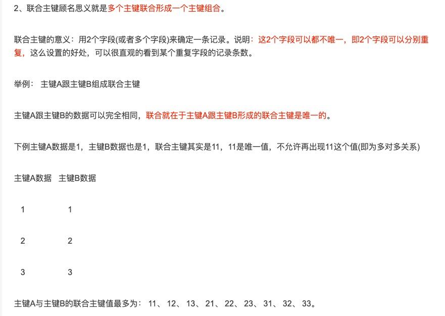
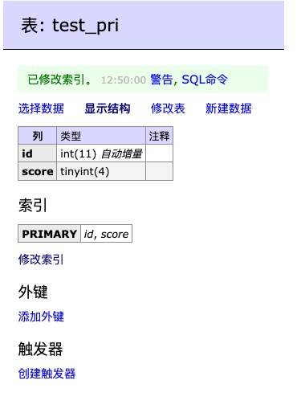
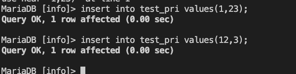
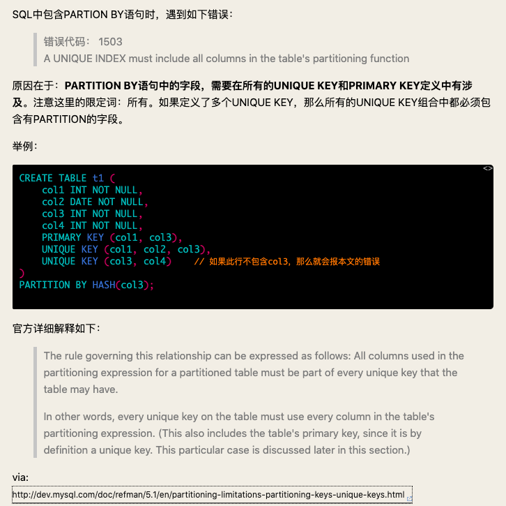
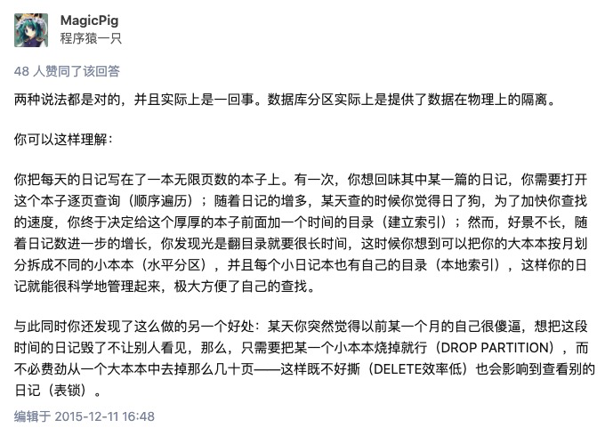

# [mysql]全表查询的优化


执行分析命令时，对于一个量级为110w的数据表进行全表扫描


```
ALTER TABLE `xx`
ADD PRIMARY KEY `id_score` (`id`, `score`),
DROP INDEX `PRIMARY`;

```










先改一下表里的数据

```
update xxx set score=-1 where score is null
    -> ;
Query OK, 2637 rows affected (8.47 sec)
Rows matched: 2637  Changed: 2637  Warnings: 0

```
然后改表的默认值，

然后加上这个联合主键

加主键的时候，我把score放前面了，又不行，必须把id放第一个


加完以后，又出问题



>为什么推荐InnoDB引擎使用自增主键？  https://www.kancloud.cn/db-design/mysql-dba/596722


> MySQL PARTITION 分区表使用教程 https://news.sangniao.com/p/2684880278
> 结合业务场景选择分区键，避免跨分区查询
对分区表进行查询最好在WHERE从句中包含分区键
具有主键或唯一索引的表，主键或唯一索引必须是分区键的一部分（这也是为什么我们上面分区时去掉了主键登录日志id(login_id)的原因，不然就无法按照上面的按年份进行分区，所以分区表其实更适合在MyISAM引擎中）
关于MyISAM和Innodb的索引区别

1.关于自动增长

myisam引擎的自动增长列必须是索引，如果是组合索引，自动增长可以不是第一列，他可以根据前面几列进行排序后递增。

innodb引擎的自动增长咧必须是索引，如果是组合索引也必须是组合索引的第一列。


>mysql 分区的真正作用? https://www.zhihu.com/question/38418707
