# cf-tools
|时间|作者|
|--|--|
|2020/2/16  0:43|moyechen|

## 下载&准备工作

GitHub 地址： [xalanq/cf-tool](https://github.com/xalanq/cf-tool/)

cf-tool 是 Codeforces 的命令行界面的跨平台（支持 Windows、Linux、OS X）工具，其支持很多常用操作。


### cf-tool下载

前往 [cf-tool/releases](https://github.com/xalanq/cf-tool/releases) 下载最新版。

之后的更新可以直接使用 upgrade 命令获取。

### windows准备工作

你的电脑需要编译器才能调试你编写的代码

对于c/cpp, 我们需要g++这款编译器
如果你拥有自带mingw的code:block这款IDE, 可以从如下位置找到
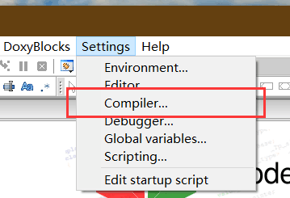
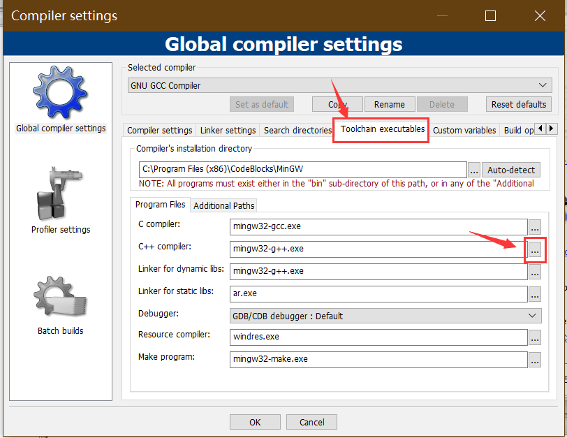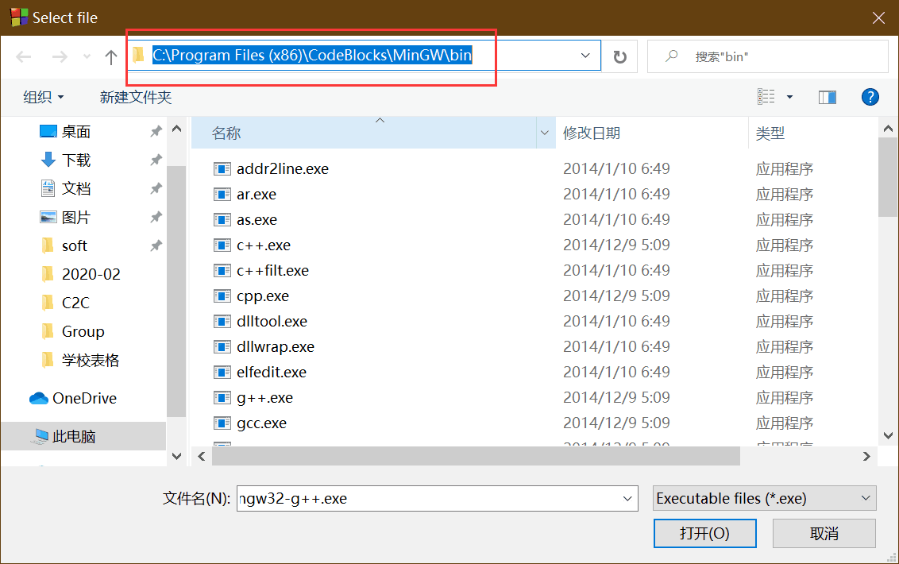

▲将第三张图片红框中的路径复制下来, 记做`compiler_path`

将这个路径添加到环境变量中,什么,你还不会添加路径到环境变量?
点击以获得讲解

否则,可以访问  https://www.jianshu.com/p/ff24a81f3637 ,参考教程下载g++编译器


#### 测试编译器是否可用

按住win键,然后输入r,在弹出的框中输入cmd
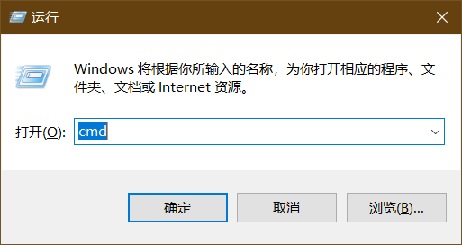

此时会打开一个黑框框

输入g++

如果出现下图,这说明编译器准备完毕

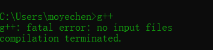


#### 添加cf.exe到环境变量

首先先将下载到的cf.exe文件放到一个合适的目录

右击 我的电脑,在弹出的下来框中选择  属性 这个选项
然后按下图操作

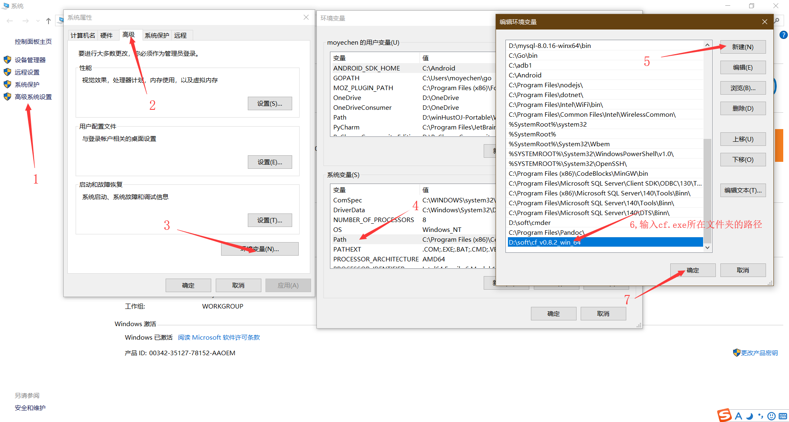


至此, 打开cmd,输入cf,如果显示以下内容,即为cf 环境变量配置成功

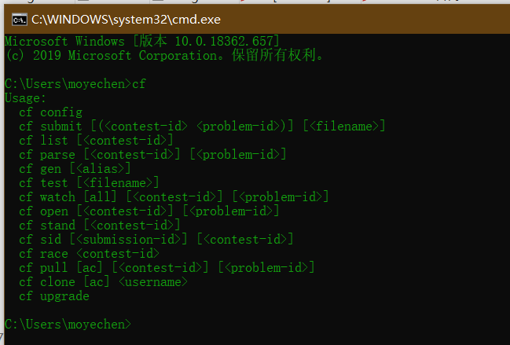


### LINUX 准备工作


#### 准备cf
将下载到cf 文件放在合适的目录,进入这个目录

执行以下命令,给予执行权限并创建软连接

```shell

chmod 775 ./cf
ln ./cf /usr/bin/cf

```

输入cf  出现下图则成功

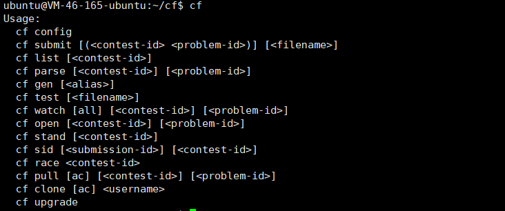


#### linux测试g++编译器是否可用

输入g++,出现下图,则为正常

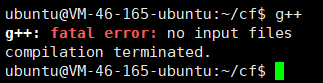

如果没有, 请自行安装g++编译器

## 配置cf


终于将准备工作做完了

我们可以开始配置了

windows用户请打开cmd
linxu 用户请进入shell

下图是我在linux的终端上操作的,windows和linux通用

输入以下命令
`cf config`

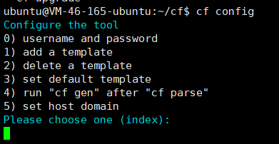


0. username and password  > 这个是用来配置用户名以及密码
1. add a template > 添加一个代码模板,可以指定语言
2. delete a template > 删除一个模板
3. 设置默认模板
4. 在解析题目结束后,自动生成模板代码
5. 设置网站主体, 比如在中国我们可以设置为镜像站 `https://codeforces.ml` 以获得更好的体验


我们选择1
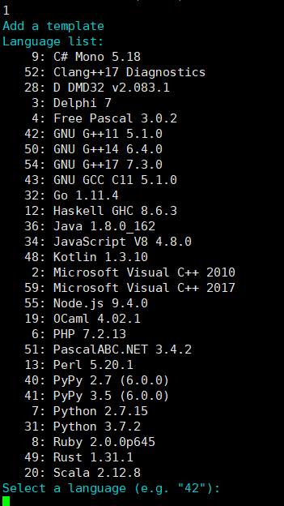

然后选择你要使用的编译器, 这里我们使用42号编译器 `GNU G++11 5.1.0`

紧接着
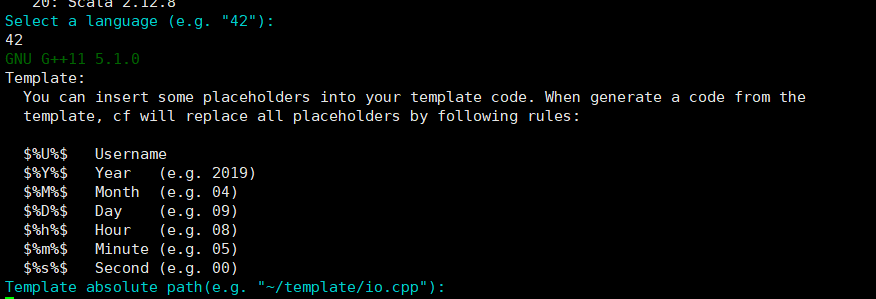

可以看到, cf-tool 提供了一些变量,比如 年月日, 以及你的用户名

这里我提供一个模板

```c++
#include<bits/stdc++.h>
using namespace std;
typedef long long ll;

/*
$%U%$
$%Y%$-$%M%$-$%D%$  $%h%$:$%m%$
*/

const int maxn = 5e5 + 5;
const int inf  = 0x3f3f3f3f;


int main() {
    std::ios::sync_with_stdio(false);
    cin.tie(0);

    return 0;
}
```


你只需要复制到一个地方,然后记住他的绝对路径,并输入即可
例如:

- `~/template.cpp`                 (适用于linux)
- `D:/template.cpp`               (适用于windows,需要带上盘符)


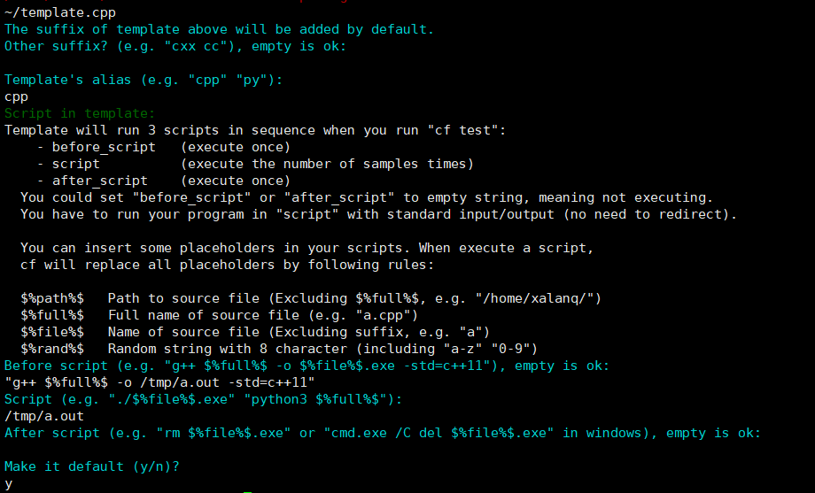


在输入后, 配置程序给了几个询问,我来分别做以下解释

1. The suffix of template above will be added by default.
Other suffix? (e.g. "cxx cc"), empty is ok: 

    默认情况下，将添加上面模板的后缀。
    需要添加其他后缀吗？（例如，“cxx cc”），空的也是可以：

    这里我们不需要了,所以直接回车


2. Template's alias (e.g. "cpp" "py"):

    模板别名,因为我们用的是cpp, 因此我输入了cpp, 别名在使用 cf gen 生成模板代码时可以用到, 比如输入cf gen cpp, 就会生成我们刚刚添加的模板

3. Script in template:
    Template will run 3 scripts in sequence when you run "cf test":
    
       - before_script   (execute once)
        - script          (execute the number of samples times)
        - after_script    (execute once)
      You could set "before_script" or "after_script" to empty string, meaning not executing.
      You have to run your program in "script" with standard input/output (no need to redirect).

      You can insert some placeholders in your scripts. When execute a script,
      cf will replace all placeholders by following rules:

      $%path%$   Path to source file (Excluding $%full%$, e.g. "/home/xalanq/")
      $%full%$   Full name of source file (e.g. "a.cpp")
      $%file%$   Name of source file (Excluding suffix, e.g. "a")
      $%rand%$   Random string with 8 character (including "a-z" "0-9")

    这一段讲的是工具的运作原理

    在你输入cf test之后

      - 首先工具执行你输入的 `before_script` 脚本, 例如 `g++ $%full%$ -o /tmp/a.out -std=c++11`, 来编译代码,并生成到`/tmp/a.out`
      - 然后执行 你输入的script脚本, 例如`/tmp/a.out `  ,这代表执行这个刚刚编译好的程序, (ps, 这一步 是用来执行程序的)
      -  接下来执行你输入的`after_script`脚本,例如执行 `rm $%file%$.exe` 以将刚刚编译好的程序删除, 防止占用硬盘空间(ps. 一般来说,acm的代码不超过5kb, 但是编译好的控制台应用程序一般在1mb左右, 但是这个程序我们只用一次,比较浪费空间,因此可以在执行后删除)


    下面我讲解一下我的输入

    - 对于第一个问题`before_script`  .我的回答是 `g++ $%full%$ -o /tmp/a.out -std=c++11`,  我每次都生成到同一个地方, 这次生成的会覆盖掉上次生成的, 也不需要删除了,其中  `/tmp/a.out` 是一个生成的路径, `-std=c++11` 是执行的c++标准, 我们可以改为`-std=c++14` 或者 `-std=c++17`以享用新特性
        -  在windows上,路径可以更改为 `D:/tmp.exe` 等等等等,需要加上盘符
    - 对于第二个问题`script` . 我的回答是 `/tmp/a.out`,  无论是linux 还是windows ,都需要写的是生成的文件的绝对路径
    - 第三个问题` after_script` .我们不需要任何处理,因此,直接回车


最后,它询问我是否作为默认设置, 输入 `y` 确认


至此, 配置结束

## 简单的流程

准备比赛了, 首先拿到比赛编号,


▲可以在url中看到比赛编号

控制台输入
`cf race 比赛编号`

▼它就会为你解析比赛测试样例,并打开题面网站

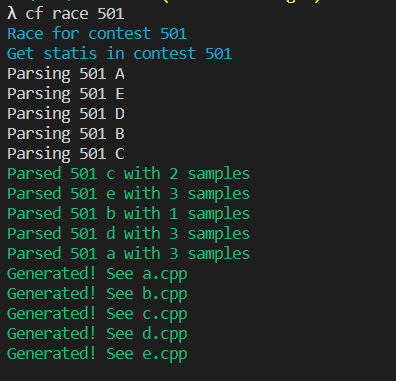


▼如果比赛未开始,他会自动等待,然后在开始的一瞬间为你解析数据

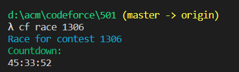


然后使用`cd`命令切换到比赛目录,并进入a题文件夹

```cd 比赛编号\a```

使用`cf gen`命令生成一个模板

你可以使用别名,这样根据你对应的模板生成代码
`cf gen cpp`

然后开始编写你的代码:

- 在linux 上 : `vim a.cpp`
- 在windows上: 如果装有vscode ,则可以使用`code -r a.cpp`,否则, 可以使用`notepad a.cpp`使用记事本,当然,你也可以在你的IDE中添加这个文件夹,以使用IDE编写代码


编写结束
使用`cf test`测试样例数据
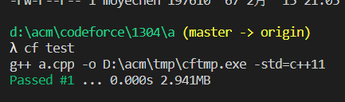

很好, 样例过了

使用`cf submit`提交你所在目录的题目

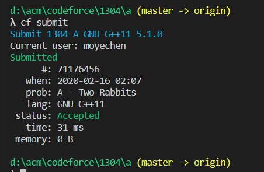

过题,

然后使用cd命令切换到其他题目的目录, 继续重复操作


