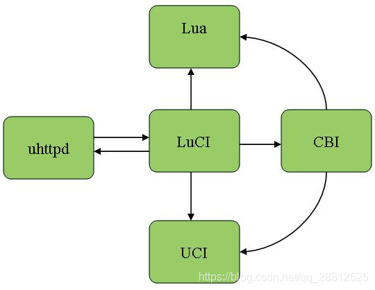

# k2p-luci

20220206
今天发现k2p的后台管理web一些功能无法使用了


为了修复这个问题,先对路由器上的web程序做了一下了解

后台服务器:uhttp
语言 lua



```
root@K2P:/# find  . -type d -iname 'luci'
./rom/usr/lib/lua/luci
./usr/lib/lua/luci
```


>https://blog.csdn.net/qq_28812525/article/details/103870169