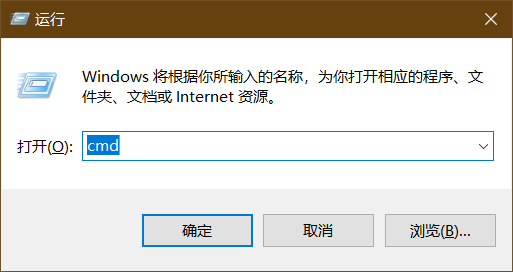

# vscode替代codeblocks

|时间|作者|
|--|--|
|2020/2/16 16:54|moyechen|

code block 这款ide在acm比赛中非常常见,  但是鉴于本人有以下需求

- 代码补全
- 一个方便的文件管理树
- 自定义代码模板
- 编译后生成的可执行文件(.exe) 定时清理

因此,本人折腾了文本编辑器 -- vscode


## 准备工作


首先下载vscode

官网链接:  https://code.visualstudio.com/

接着,将编译器的目录添加到环境变量
如果你有code::blocks
可以参考以下:

打开code::blocks


复制蓝色内容,然后加上`\bin`

例如      `C:\Program Files (x86)\CodeBlocks\MinGW\bin` , 记为`compiler_path`变量

接着,添加到系统环境变量


这里, 第六步我们输入 `C:\Program Files (x86)\CodeBlocks\MinGW\bin` (如果你的code::block是默认安装的话,否则,请你使用刚刚拼接的字符串`compilar_path`)

如果你没有code::block, 请你自行将g++编译器添加到环境变量

### 测试编译器是否可用

按住win键,然后输入r,在弹出的框中输入cmd


此时会打开一个黑框框

输入g++

如果出现下图,这说明编译器准备完毕


## vscode配置

### 插件安装
安装好后, 点击左侧栏第5个按钮,依次安装下方3个插件

▼ `code runner` (在输入框输入code runner进行搜索)


▼`中文插件`

在输入框输入 `chinese` 进行搜索


以及 `C/C++` 插件


__提示__: 安装完毕后, 请重新启动vscode

### vscode 初体验

重启过后, 我们打开一个文件夹


然后右键,新建文件,输入文件名,这里我输入的是test.cpp


接着,我们输入一个测试代码,可以看到, vscode已经可以智能补全了


输入完毕后, 右击输入区域, 点击第一项 `Run Code` ,可以在下方看到输出


这表示我们已经可以使用了

但是这个输入区域无法接受输入, 也就是我们无法拿测试用例进行调试


### 解决输出区域无法输入的问题

我们将代码调试放在终端(之中,终端可以接受输入,就解决了这个问题

我们需要增加以下几条设置

首先, 打开setting.json


之后, 输入一条

`"code-runner.runInTerminal": true, `


`Ctrl + S` 保存后重启vscode, 重新运行代码, 可以看到已经可以输入了


### 生成文件放在固定目录,减少硬盘占用

默认设置中,生成的文件和代码文件同目录, 也就是说,对于每一个代码,我们都要生成这么一个.exe文件

一个.cpp 代码文件一般不会超过5kb, 但是一个可执行文件一般是 1mb左右

这不但增加了磁盘空间的负担,同时也使我们文件管理非常的混乱

使用以下操作解决:

打开 `setting.json` 添加这几条内容

```
    "terminal.integrated.shell.windows": "C:\\WINDOWS\\System32\\cmd.exe",
    "code-runner.executorMap": {
        "cpp": "cd $dir && g++ -o D:\\temp.exe \"$fileName\"  -std=c++11 &&  D:\\temp.exe"
    }
```

这些代码的意思:

- 第一行表示指定使用的终端为cmd, win10默认使用的PowerShell 语法与Cmd 的语法不大相同,我们选择熟悉的Cmd
- 第二行表示执行代码是运行的命令,我们分开解析这条命令
    -  `cd $dir` ,  进入代码所在的目录
    -   `g++ -o D:\\temp.exe \"$fileName\"  -std=c++11 `, 使用c++11的标准编译你当前编辑的文件,然后生成可执行文件到 `D:\\temp.exe`, 可以更改为 `-std=c++14` 以使用更多特性, 或者更改 `D:\\temp.exe` 为你喜欢的路径
    -  `D:\\temp.exe` ,执行你生成好的可执行文件
    - 其中`&&` 在c/c++语言中是且的意思, 也就是说, 执行完第一步 `cd $dir ` 后, 我们才能安全的执行第二步操作,因此使用并且并且连接符


紧接着, 我们再添加以下内容:

```

    "code-runner.preserveFocus": false,        
    "code-runner.saveFileBeforeRun": true,
```

▲第一行: 运行后光标聚焦在终端
▲第二行: 运行前自动保存文件


添加后的样子

接着,__重启__VsCode

已经可以使用了