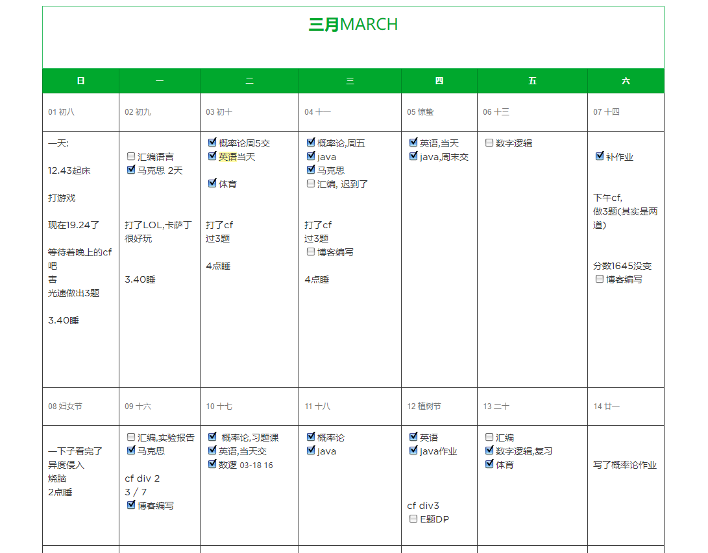
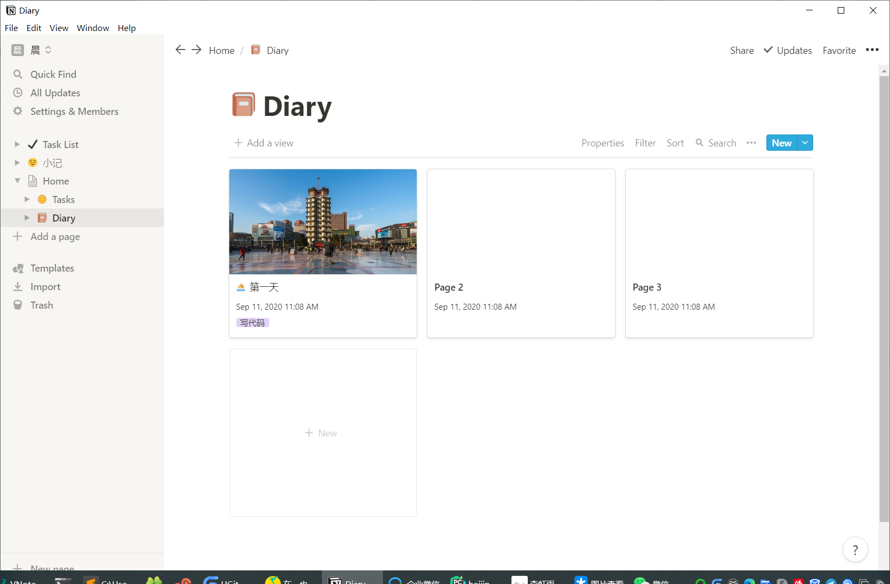

# 甲骨文服务器凉凉

>https://51.ruyo.net/14138.html  白嫖甲骨文vps 2019年9月17

## 20200911甲骨文复活辣

白嫖了两台, 一台使用tcp 链接, 一台使用websocket+tsl(需要域名解析) 链接, 测速如下

|      服务器      |    传输协议    | 下载 | 上传 | 延迟  | 抖动  | 丢包 |
| --------------- | ------------- | ---- | ---- | ----- | ----- | ---- |
| 132.145.112.212 | websocket+tsl | 11.5 | 3.20 | 95ms  | 12ms  | -    |
| 168.138.214.1   | tcp           | 12.7 | 7.61 | 331ms | 436ms |      |

## 2020/2/24

使用[drive to web](https://drv.tw/)

[教程](https://www.alexclassroom.com/web-building/webmaster-tool/how-to-build-site-on-onedrive-drivetoweb/)

- 本地使用VNote进行编辑,将笔记文件夹设置到  onedrive 目录下
- 编辑后自动更新onedrive,免去手动同步的麻烦
- 使用drive to web 配合域名cname指向,完成博客搭建

## 20200215 甲骨文凉凉
因此我需要一个新的服务器

需求:

- 搭建博客
    -  同时要提供vnote - onedrive这种方式的 `日记 - 博客` 工作流
- vpn
    - 平时使用谷歌服务
- 内网穿透

因此, 可能需要国外服务器才能支持

博客搭建方案:
1. github/gitee/coding pages
2. 阿里云，其它云
3. 虚拟主机
4. 其它
5. 阿里云（入口 nginx 转发）+ 腾讯云（应用+数据库）
6.  github pages + cloudflare
7. 阿里云->vultr->github pages->netlify
8. 利用 Gridea 同步到 GitHub，然后再同步到 Netlify http://fehey.com
9. 本地 N1+frp
10. cnblogs, csdn (不想)

大佬的博客:

1. https://www.dute.org/
2. 

# 思考

## 处理笔记的分类方式

### 笔记的种类:

- 灵感  
- 待办事项 
- 日记
- 笔记
- 特殊的( 印象笔记剪藏,马克)

### 可用的笔记,提醒,便签软件

|品名| 平台|云同步|备注|
| --|--|--|--|
| OneNote|全平台|√||
| 印象笔记|全平台,免费版最多两台设备|√||
| 微软待办|全平台|√||
| 习惯|android|×||
| VNote|桌面端|×|配合onedrive可以同步,以及搭建博客|

### 场景
展示给别人看的博客 -- Vnote + viki + onedrive + drive to web
自己的日记 -- 印象笔记+ 日历

## 找到合适的写日记软件
notion  -- 颜值即是正义

# 笔记型博客

[MDwiki](http://dynalon.github.io/mdwiki/#!index.md)
- 适合为开发的应用程序编写wiki
- 无法实现多层文件夹
- 具有github风格的markdown渲染器
- 可使用gimmicks, 以获得例如github-fork带子, 讨论区, 等插件

[vnote-viki](https://github.com/tamlok/viki)
- 配合vnote,以及onedrive云同步,适更合写笔记
- 有多层文件夹
- 渲染风格简陋,但是可以定制化(暂未找到方法)

