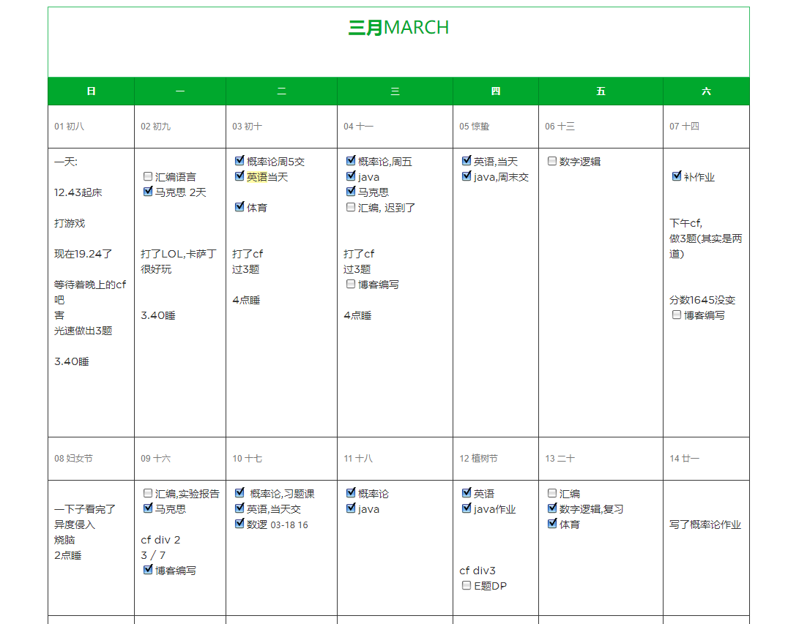

# 数据整理

## 处理笔记的分类方式

### 笔记的种类:

- 灵感  
- 待办事项 
- 日记
- 笔记
- 特殊的( 印象笔记剪藏,马克)

### 可用的笔记,提醒,便签软件

|   品名   |          平台           |     云同步      |                备注                 |
| ------- | ----------------------- | --------------- | ----------------------------------- |
| OneNote | 全平台                  | √               | 编写代码感觉很差                     |
| 印象笔记 | 全平台,免费版最多两台设备 | √               | 用来写日记,适合个人喜欢               |
| 微软待办 | 全平台                  | √               |                                     |
| 习惯     | android                 | ×               | 可以用来打卡,带有提醒                 |
| VNote   | 桌面端                  | ×               | 配合onedrive可以同步,以及viki搭建博客 |
| notion  | 全平台                  | √ (需要科学上网) |                                     |
| 闪念胶囊 | 仅                      |                 |                                     |

### 场景
展示给别人看的博客 -- Vnote + viki + onedrive + drive to web
自己的日记 -- 印象笔记+ 日历

### 找到合适的写日记软件
notion  -- 颜值即是正义

## 照片相片的备份, 归纳

### 调研
|     途径      |               价格                |     功能      |      备注      |
| ------------ | --------------------------------- | ------------- | ------------- |
| onedrive     | 5g免费 ￥40/年 1t(可以存储其他文件) | 去年今日       | 和windows 搭配 |
| google photo | 15g免费 无限量的有损图片            | 自动处理,分类, | 需要翻墙       |
| nas          | 机器费用+网络费用                  |               |               |
| 百度云盘      |                                   |               |               |
| 微云         |                                   |               |               |

### ondrive

家庭版本去闲鱼拼车大概可以做到 40一年
包含1t存储

### google photo

平时在公司的时候使用,其他时候上网不稳定因此不多使用